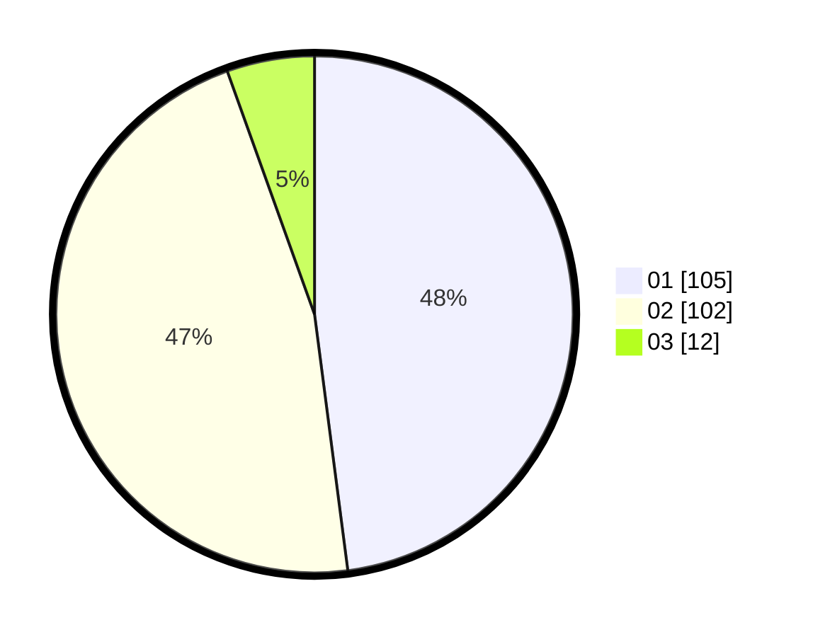

# Hasil

Hasil perolehan suara paslon dapat dilihat pada file paslon-01.txt, paslon-02.txt, dan paslon-03.txt.

Jika tidak ada, artinya data tersebut belum ada pada SIREKAP.

## Perolehan Suara

 * Paslon 01: **105**.
 * Paslon 02: **102**.
 * Paslon 03: **12**.

## Foto C Plano

https://sirekap-obj-formc.kpu.go.id/3571/pemilu/ppwp/31/73/08/10/01/3173081001138-20240216-101214--8bf631a6-2c70-44cf-8d12-fa38e4fb3052.jpg

https://sirekap-obj-formc.kpu.go.id/3571/pemilu/ppwp/31/73/08/10/01/3173081001138-20240216-101216--af7068a0-37b3-4469-8f2e-289575563ee4.jpg

https://sirekap-obj-formc.kpu.go.id/3571/pemilu/ppwp/31/73/08/10/01/3173081001138-20240216-101215--793b4f0f-e143-493b-9dd9-817e9b75298e.jpg

## DATA PEMILIH TETAP

Jumlah pemilih dalam DPT: **267**.
 * L: **140**.
 * P: **127**.

## DATA PENGGUNA HAK PILIH

Jumlah pengguna hak pilih dalam DPT: **212**.
 * L: **109**.
 * P: **103**.

Jumlah pengguna hak pilih dalam DPTb: **10**.
 * L: **3**.
 * P: **7**.

Jumlah pengguna hak pilih dalam DPK: **1**.
 * L: **1**.
 * P: **0**.

Jumlah pengguna hak pilih: **223**.
 * L: **113**.
 * P: **110**.

## JUMLAH SUARA SAH DAN TIDAK SAH

JUMLAH SELURUH SUARA SAH: **219**.

JUMLAH SUARA TIDAK SAH: **4**.

JUMLAH SELURUH SUARA SAH DAN SUARA TIDAK SAH: **223**.
