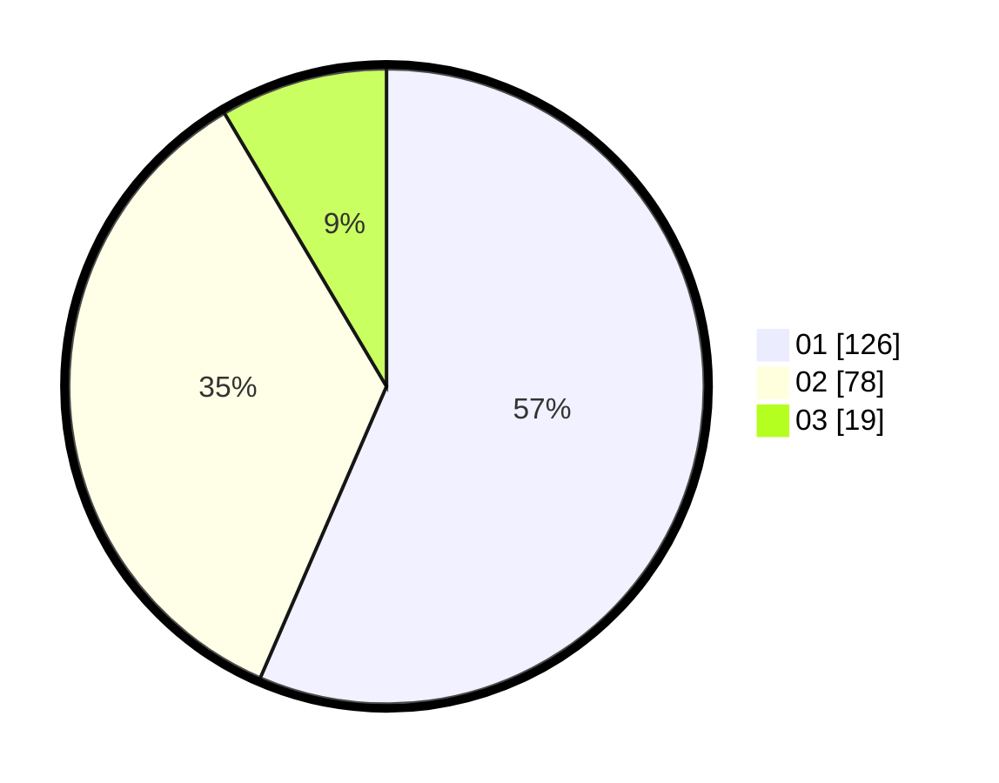

# Hasil

Hasil perolehan suara paslon dapat dilihat pada file paslon-01.txt, paslon-02.txt, dan paslon-03.txt.

Jika tidak ada, artinya data tersebut belum ada pada SIREKAP.

## Perolehan Suara

 * Paslon 01: **126**.
 * Paslon 02: **78**.
 * Paslon 03: **19**.

## Foto C Plano

https://sirekap-obj-formc.kpu.go.id/eae2/pemilu/ppwp/31/73/08/10/01/3173081001140-20240215-012010--5ba275f7-06c0-48b7-82c1-346569144ef9.jpg

https://sirekap-obj-formc.kpu.go.id/eae2/pemilu/ppwp/31/73/08/10/01/3173081001140-20240215-192832--15210e62-67ae-4a2c-9e9f-c5d874ec3f8b.jpg

https://sirekap-obj-formc.kpu.go.id/eae2/pemilu/ppwp/31/73/08/10/01/3173081001140-20240215-012234--f115aa29-accf-4287-8790-be3e4e167e18.jpg

## DATA PEMILIH TETAP

Jumlah pemilih dalam DPT: **265**.
 * L: **123**.
 * P: **142**.

## DATA PENGGUNA HAK PILIH

Jumlah pengguna hak pilih dalam DPT: **213**.
 * L: **107**.
 * P: **106**.

Jumlah pengguna hak pilih dalam DPTb: **3**.
 * L: **1**.
 * P: **2**.

Jumlah pengguna hak pilih dalam DPK: **8**.
 * L: **5**.
 * P: **3**.

Jumlah pengguna hak pilih: **224**.
 * L: **113**.
 * P: **111**.

## JUMLAH SUARA SAH DAN TIDAK SAH

JUMLAH SELURUH SUARA SAH: **223**.

JUMLAH SUARA TIDAK SAH: **1**.

JUMLAH SELURUH SUARA SAH DAN SUARA TIDAK SAH: **224**.
