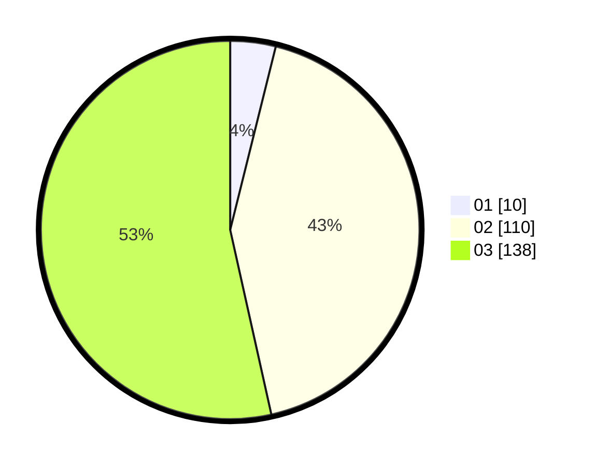

# Hasil

Hasil perolehan suara paslon dapat dilihat pada file paslon-01.txt, paslon-02.txt, dan paslon-03.txt.

Jika tidak ada, artinya data tersebut belum ada pada SIREKAP.

## Perolehan Suara

 * Paslon 01: **10**.
 * Paslon 02: **110**.
 * Paslon 03: **138**.

## Foto C Plano

https://sirekap-obj-formc.kpu.go.id/dd23/pemilu/ppwp/31/73/08/10/01/3173081001145-20240214-195302--ef189445-d71a-4ef1-9972-4e988b164a03.jpg

https://sirekap-obj-formc.kpu.go.id/dd23/pemilu/ppwp/31/73/08/10/01/3173081001145-20240214-191336--ad0253cf-da91-49d3-9f08-fa5ebb5ff98d.jpg

https://sirekap-obj-formc.kpu.go.id/dd23/pemilu/ppwp/31/73/08/10/01/3173081001145-20240214-191341--67d8081a-538f-4f47-bbdf-b9edd3226e39.jpg
