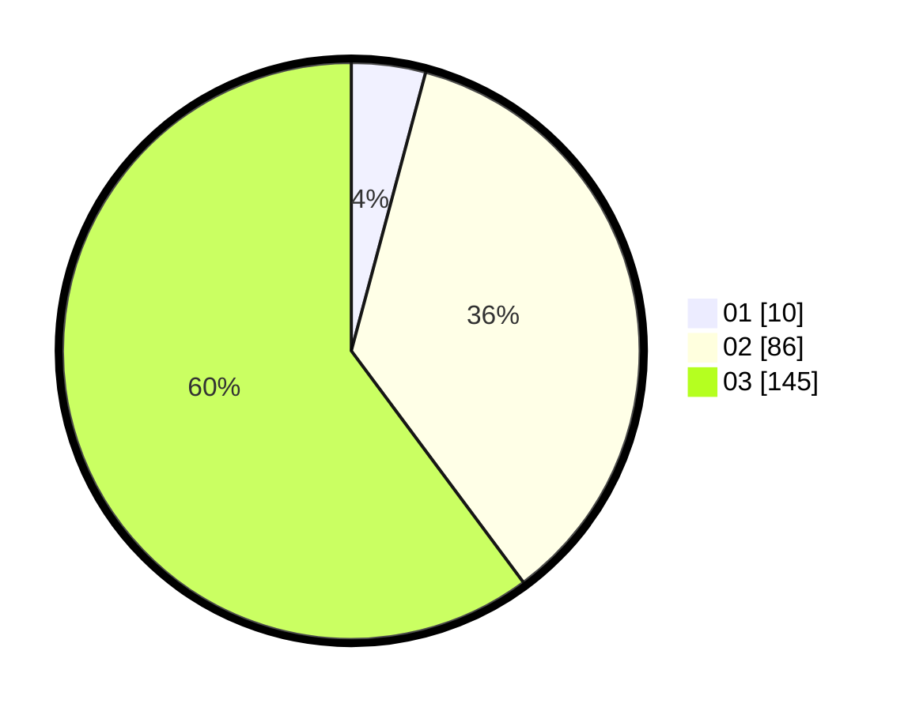

# Hasil

Hasil perolehan suara paslon dapat dilihat pada file paslon-01.txt, paslon-02.txt, dan paslon-03.txt.

Jika tidak ada, artinya data tersebut belum ada pada SIREKAP.

## Perolehan Suara

 * Paslon 01: **10**.
 * Paslon 02: **86**.
 * Paslon 03: **145**.

## Foto C Plano

https://sirekap-obj-formc.kpu.go.id/4551/pemilu/ppwp/31/73/08/10/01/3173081001146-20240214-185408--71d444fe-795c-44db-b88c-cc178ebd7069.jpg

https://sirekap-obj-formc.kpu.go.id/4551/pemilu/ppwp/31/73/08/10/01/3173081001146-20240214-185415--bccd7fcb-4f8c-4cd0-a2cb-42953434782e.jpg

https://sirekap-obj-formc.kpu.go.id/4551/pemilu/ppwp/31/73/08/10/01/3173081001146-20240214-202107--9a411c51-f1f6-4b27-a6c4-a70026c0dd5e.jpg

## DATA PEMILIH TETAP

Jumlah pemilih dalam DPT: **298**.
 * L: **150**.
 * P: **148**.

## DATA PENGGUNA HAK PILIH

Jumlah pengguna hak pilih dalam DPT: **219**.
 * L: **108**.
 * P: **111**.

Jumlah pengguna hak pilih dalam DPTb: **14**.
 * L: **4**.
 * P: **10**.

Jumlah pengguna hak pilih dalam DPK: **11**.
 * L: **6**.
 * P: **5**.

Jumlah pengguna hak pilih: **244**.
 * L: **118**.
 * P: **126**.

## JUMLAH SUARA SAH DAN TIDAK SAH

JUMLAH SELURUH SUARA SAH: **241**.

JUMLAH SUARA TIDAK SAH: **3**.

JUMLAH SELURUH SUARA SAH DAN SUARA TIDAK SAH: **244**.
