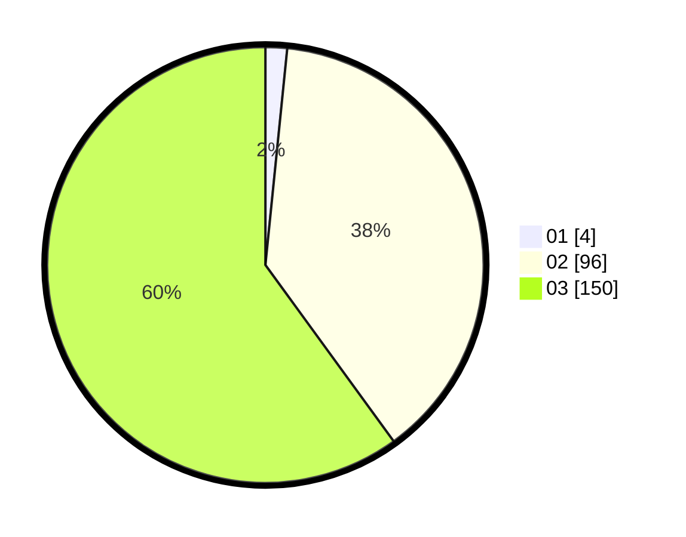

# Hasil

Hasil perolehan suara paslon dapat dilihat pada file paslon-01.txt, paslon-02.txt, dan paslon-03.txt.

Jika tidak ada, artinya data tersebut belum ada pada SIREKAP.

## Perolehan Suara

 * Paslon 01: **4**.
 * Paslon 02: **96**.
 * Paslon 03: **150**.

## Foto C Plano

https://sirekap-obj-formc.kpu.go.id/59cd/pemilu/ppwp/31/73/08/10/01/3173081001148-20240214-214736--ab8cd093-cc3d-462d-aaba-ebf42d84ea6b.jpg

https://sirekap-obj-formc.kpu.go.id/59cd/pemilu/ppwp/31/73/08/10/01/3173081001148-20240214-214802--b7f3bf77-1df3-4f7e-b41e-37b3d13832fc.jpg

https://sirekap-obj-formc.kpu.go.id/59cd/pemilu/ppwp/31/73/08/10/01/3173081001148-20240214-214712--405ed30f-3063-4cfc-96c2-9972e4d03a42.jpg
