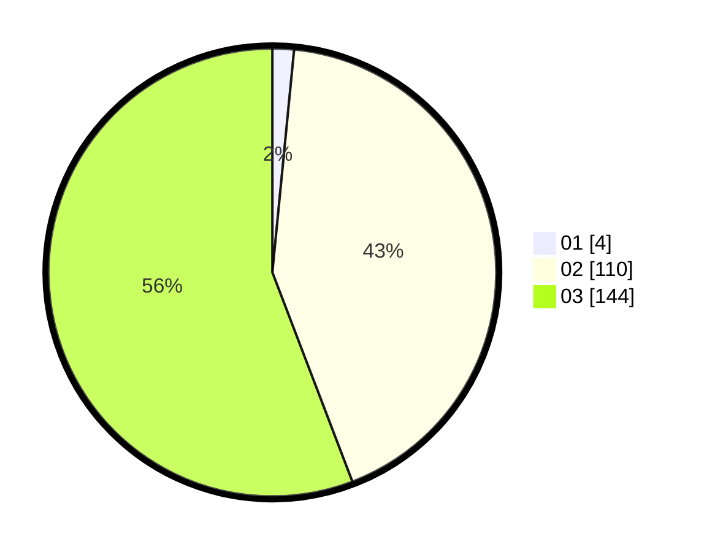

# Hasil

Hasil perolehan suara paslon dapat dilihat pada file paslon-01.txt, paslon-02.txt, dan paslon-03.txt.

Jika tidak ada, artinya data tersebut belum ada pada SIREKAP.

## Perolehan Suara

 * Paslon 01: **4**.
 * Paslon 02: **110**.
 * Paslon 03: **144**.

## Foto C Plano

https://sirekap-obj-formc.kpu.go.id/c189/pemilu/ppwp/31/73/08/10/01/3173081001149-20240214-212914--1015e670-4c3e-4dd1-b59b-8ca0cb05fe2a.jpg

https://sirekap-obj-formc.kpu.go.id/c189/pemilu/ppwp/31/73/08/10/01/3173081001149-20240214-213012--6cf13ee6-8809-4b4b-8719-d0c34d7c470b.jpg

https://sirekap-obj-formc.kpu.go.id/c189/pemilu/ppwp/31/73/08/10/01/3173081001149-20240214-213111--d7ef68ad-b910-4568-835c-b535be66a991.jpg
