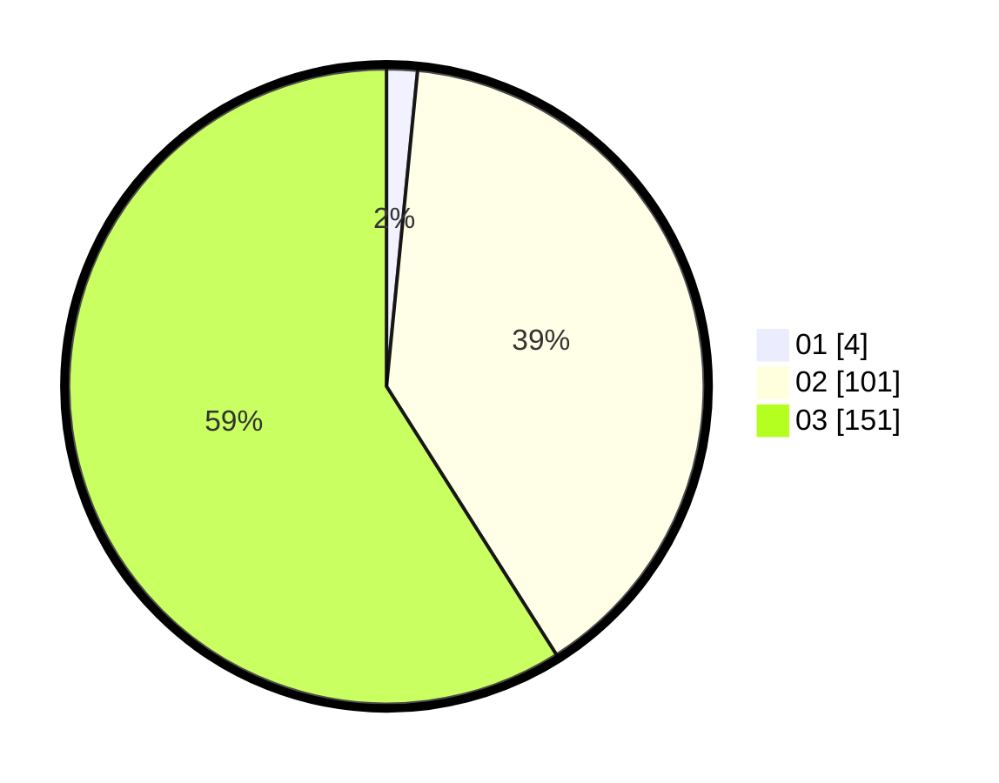

# Hasil

Hasil perolehan suara paslon dapat dilihat pada file paslon-01.txt, paslon-02.txt, dan paslon-03.txt.

Jika tidak ada, artinya data tersebut belum ada pada SIREKAP.

## Perolehan Suara

 * Paslon 01: **4**.
 * Paslon 02: **101**.
 * Paslon 03: **151**.

## Foto C Plano

https://sirekap-obj-formc.kpu.go.id/0d94/pemilu/ppwp/31/73/08/10/01/3173081001151-20240214-230944--67095680-dde2-4267-acc5-1b9da7c99a35.jpg

https://sirekap-obj-formc.kpu.go.id/0d94/pemilu/ppwp/31/73/08/10/01/3173081001151-20240214-194602--574b0c4e-e85b-4983-a2c0-cf8cbd06af9e.jpg

https://sirekap-obj-formc.kpu.go.id/0d94/pemilu/ppwp/31/73/08/10/01/3173081001151-20240214-231549--39540b89-d0da-4a21-9f1e-a7ef345a09ed.jpg
