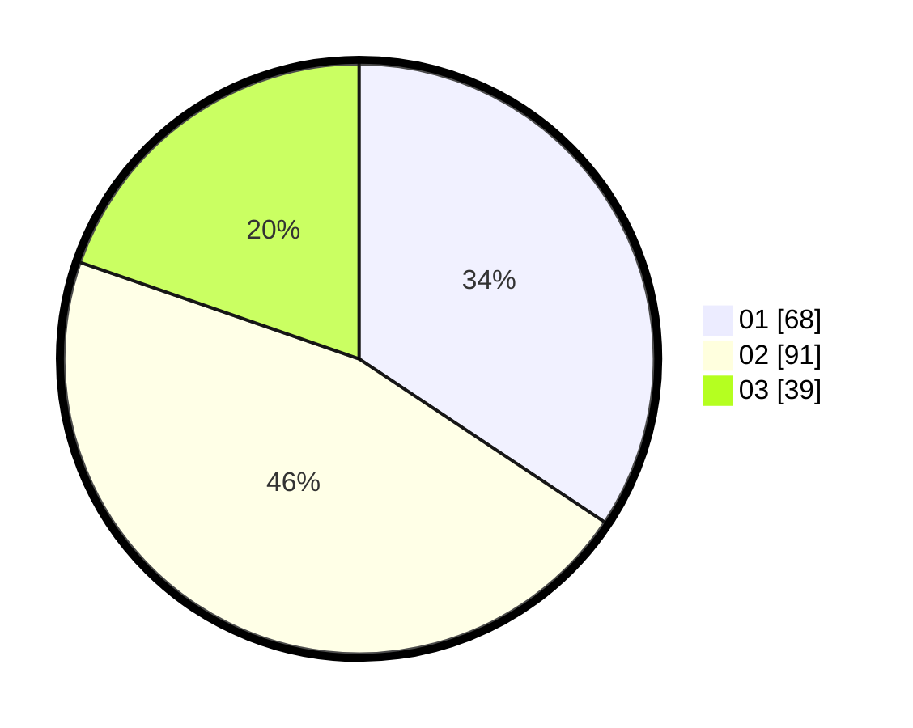

# Hasil

Hasil perolehan suara paslon dapat dilihat pada file paslon-01.txt, paslon-02.txt, dan paslon-03.txt.

Jika tidak ada, artinya data tersebut belum ada pada SIREKAP.

## Perolehan Suara

 * Paslon 01: **68**.
 * Paslon 02: **91**.
 * Paslon 03: **39**.

## Foto C Plano

https://sirekap-obj-formc.kpu.go.id/6022/pemilu/ppwp/31/73/08/10/01/3173081001162-20240214-212059--bee9f4e2-1cba-4907-9ba9-c1b7be6acc9b.jpg

https://sirekap-obj-formc.kpu.go.id/6022/pemilu/ppwp/31/73/08/10/01/3173081001162-20240214-212448--761ca2b1-6c9e-4e08-a28a-cb510d6def95.jpg

https://sirekap-obj-formc.kpu.go.id/6022/pemilu/ppwp/31/73/08/10/01/3173081001162-20240214-212554--9fb38410-7c7e-4f5a-893f-0e6eb481e279.jpg
