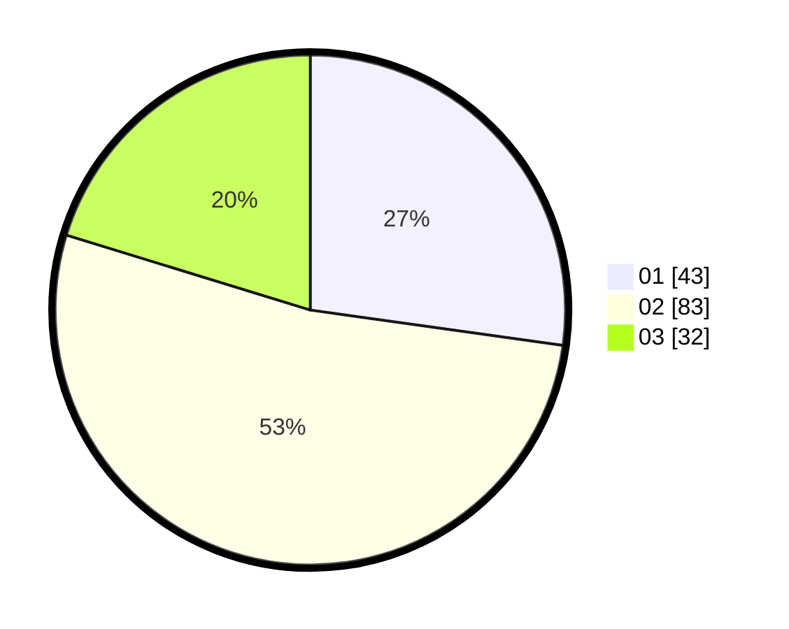

# Hasil

Hasil perolehan suara paslon dapat dilihat pada file paslon-01.txt, paslon-02.txt, dan paslon-03.txt.

Jika tidak ada, artinya data tersebut belum ada pada SIREKAP.

## Perolehan Suara

 * Paslon 01: **43**.
 * Paslon 02: **83**.
 * Paslon 03: **32**.

## Foto C Plano

https://sirekap-obj-formc.kpu.go.id/34e0/pemilu/ppwp/31/73/08/10/01/3173081001164-20240215-235453--0a9b5c40-84ae-45a3-9ff0-a2814bc7e2e8.jpg

https://sirekap-obj-formc.kpu.go.id/34e0/pemilu/ppwp/31/73/08/10/01/3173081001164-20240214-184625--ae3c31be-8b9c-47d3-b6a2-4e60f6161aaf.jpg

https://sirekap-obj-formc.kpu.go.id/34e0/pemilu/ppwp/31/73/08/10/01/3173081001164-20240214-184538--3723f7c7-b279-4e9c-b257-bb86164c80f3.jpg

## DATA PEMILIH TETAP

Jumlah pemilih dalam DPT: **234**.
 * L: **113**.
 * P: **121**.

## DATA PENGGUNA HAK PILIH

Jumlah pengguna hak pilih dalam DPT: **165**.
 * L: **74**.
 * P: **91**.

Jumlah pengguna hak pilih dalam DPTb: **0**.
 * L: **0**.
 * P: **0**.

Jumlah pengguna hak pilih dalam DPK: **0**.
 * L: **0**.
 * P: **0**.

Jumlah pengguna hak pilih: **165**.
 * L: **74**.
 * P: **91**.

## JUMLAH SUARA SAH DAN TIDAK SAH

JUMLAH SELURUH SUARA SAH: **158**.

JUMLAH SUARA TIDAK SAH: **7**.

JUMLAH SELURUH SUARA SAH DAN SUARA TIDAK SAH: **165**.
