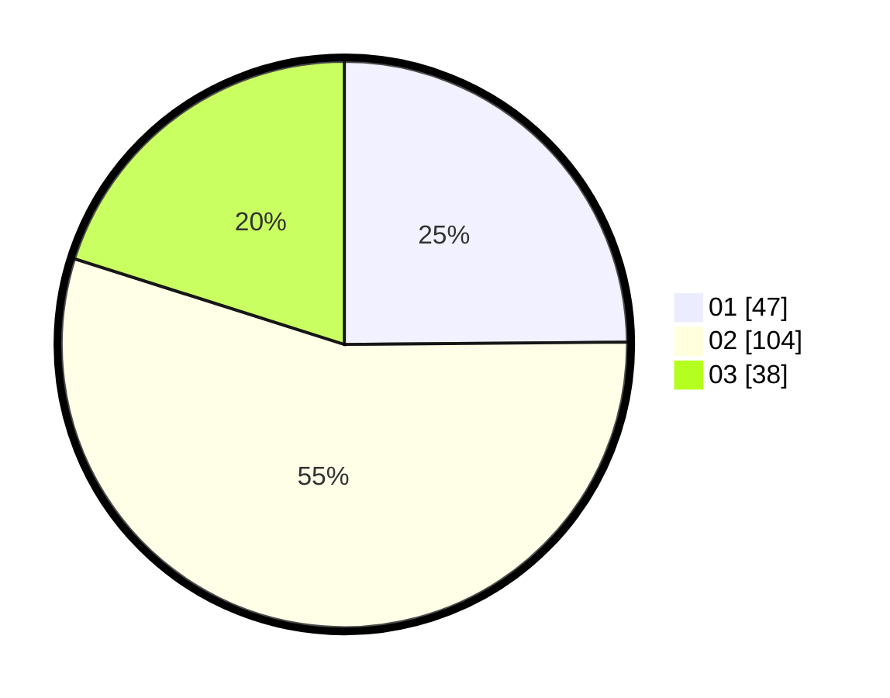

# Hasil

Hasil perolehan suara paslon dapat dilihat pada file paslon-01.txt, paslon-02.txt, dan paslon-03.txt.

Jika tidak ada, artinya data tersebut belum ada pada SIREKAP.

## Perolehan Suara

 * Paslon 01: **47**.
 * Paslon 02: **104**.
 * Paslon 03: **38**.

## Foto C Plano

https://sirekap-obj-formc.kpu.go.id/b623/pemilu/ppwp/31/73/08/10/01/3173081001167-20240215-032040--a058f6c3-c71f-45f9-84ca-9f6a9bf0fb7c.jpg

https://sirekap-obj-formc.kpu.go.id/b623/pemilu/ppwp/31/73/08/10/01/3173081001167-20240215-071658--fa295ba5-75a3-4a8d-9b12-00010aaf9d11.jpg

https://sirekap-obj-formc.kpu.go.id/b623/pemilu/ppwp/31/73/08/10/01/3173081001167-20240215-071742--804107fa-d54a-438c-a205-c8937c8fd5b0.jpg
