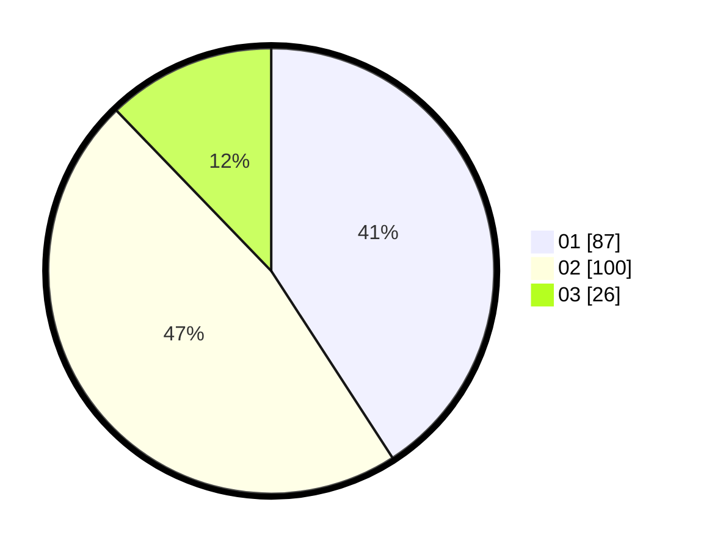

# Hasil

Hasil perolehan suara paslon dapat dilihat pada file paslon-01.txt, paslon-02.txt, dan paslon-03.txt.

Jika tidak ada, artinya data tersebut belum ada pada SIREKAP.

## Perolehan Suara

 * Paslon 01: **87**.
 * Paslon 02: **100**.
 * Paslon 03: **26**.

## Foto C Plano

https://sirekap-obj-formc.kpu.go.id/8d31/pemilu/ppwp/31/73/08/10/01/3173081001168-20240214-205922--643a3905-cc3a-4095-a611-1374425dba14.jpg

https://sirekap-obj-formc.kpu.go.id/8d31/pemilu/ppwp/31/73/08/10/01/3173081001168-20240214-205932--18c09b47-6753-4b15-85a1-9eff9f3a7bd4.jpg

https://sirekap-obj-formc.kpu.go.id/8d31/pemilu/ppwp/31/73/08/10/01/3173081001168-20240214-205936--585ca9f9-3dac-47dc-a95f-3c7b6ba664de.jpg

## DATA PEMILIH TETAP

Jumlah pemilih dalam DPT: **269**.
 * L: **140**.
 * P: **129**.

## DATA PENGGUNA HAK PILIH

Jumlah pengguna hak pilih dalam DPT: **214**.
 * L: **107**.
 * P: **107**.

Jumlah pengguna hak pilih dalam DPTb: **0**.
 * L: **0**.
 * P: **0**.

Jumlah pengguna hak pilih dalam DPK: **1**.
 * L: **0**.
 * P: **1**.

Jumlah pengguna hak pilih: **215**.
 * L: **107**.
 * P: **108**.

## JUMLAH SUARA SAH DAN TIDAK SAH

JUMLAH SELURUH SUARA SAH: **213**.

JUMLAH SUARA TIDAK SAH: **2**.

JUMLAH SELURUH SUARA SAH DAN SUARA TIDAK SAH: **215**.
