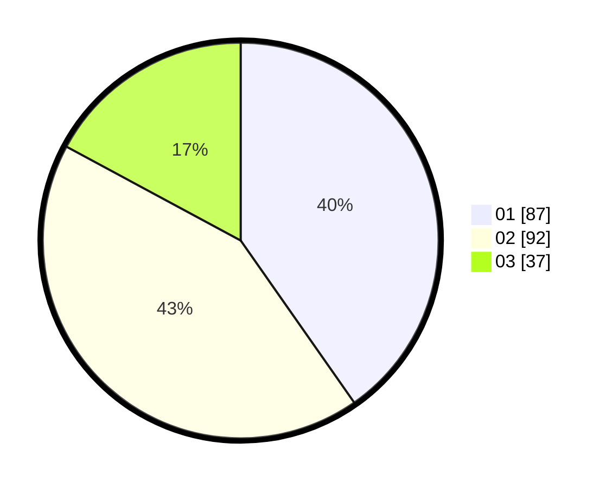

# Hasil

Hasil perolehan suara paslon dapat dilihat pada file paslon-01.txt, paslon-02.txt, dan paslon-03.txt.

Jika tidak ada, artinya data tersebut belum ada pada SIREKAP.

## Perolehan Suara

 * Paslon 01: **87**.
 * Paslon 02: **92**.
 * Paslon 03: **37**.

## Foto C Plano

https://sirekap-obj-formc.kpu.go.id/7e4b/pemilu/ppwp/31/73/08/10/01/3173081001171-20240215-062914--82c47212-b807-4716-947c-5374c7766262.jpg

https://sirekap-obj-formc.kpu.go.id/7e4b/pemilu/ppwp/31/73/08/10/01/3173081001171-20240215-063117--e94a407c-4187-49ba-abea-4b382952f8c7.jpg
