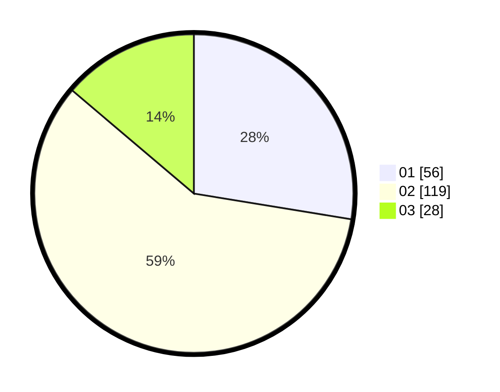

# Hasil

Hasil perolehan suara paslon dapat dilihat pada file paslon-01.txt, paslon-02.txt, dan paslon-03.txt.

Jika tidak ada, artinya data tersebut belum ada pada SIREKAP.

## Perolehan Suara

 * Paslon 01: **56**.
 * Paslon 02: **119**.
 * Paslon 03: **28**.

## Foto C Plano

https://sirekap-obj-formc.kpu.go.id/0cd8/pemilu/ppwp/31/73/08/10/01/3173081001174-20240214-204250--b62a6901-5e36-4432-9510-84baa307ba49.jpg

https://sirekap-obj-formc.kpu.go.id/0cd8/pemilu/ppwp/31/73/08/10/01/3173081001174-20240214-204306--a8da2c63-d4b2-49bf-aaf7-93c3dcf70f64.jpg

https://sirekap-obj-formc.kpu.go.id/0cd8/pemilu/ppwp/31/73/08/10/01/3173081001174-20240214-204330--4229e507-8bdf-4acd-b9c9-946c0ba50ba9.jpg

## DATA PEMILIH TETAP

Jumlah pemilih dalam DPT: **280**.
 * L: **141**.
 * P: **139**.

## DATA PENGGUNA HAK PILIH

Jumlah pengguna hak pilih dalam DPT: **199**.
 * L: **92**.
 * P: **107**.

Jumlah pengguna hak pilih dalam DPTb: **1**.
 * L: **1**.
 * P: **0**.

Jumlah pengguna hak pilih dalam DPK: **6**.
 * L: **4**.
 * P: **2**.

Jumlah pengguna hak pilih: **206**.
 * L: **97**.
 * P: **109**.

## JUMLAH SUARA SAH DAN TIDAK SAH

JUMLAH SELURUH SUARA SAH: **203**.

JUMLAH SUARA TIDAK SAH: **3**.

JUMLAH SELURUH SUARA SAH DAN SUARA TIDAK SAH: **206**.
