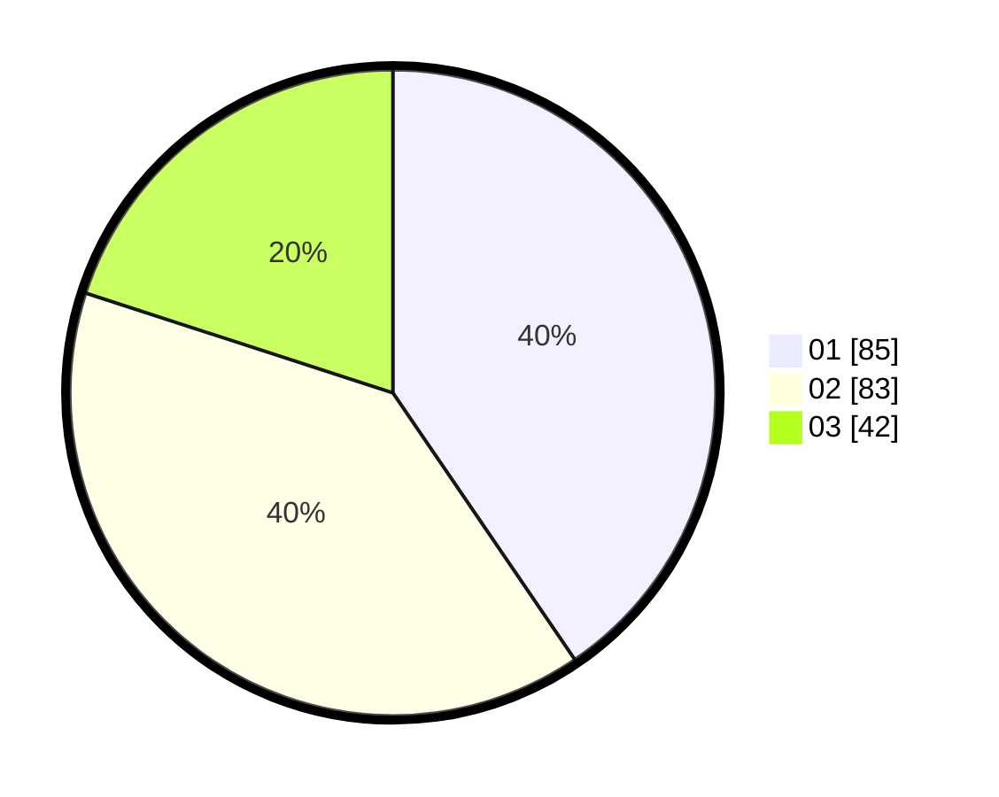

# Hasil

Hasil perolehan suara paslon dapat dilihat pada file paslon-01.txt, paslon-02.txt, dan paslon-03.txt.

Jika tidak ada, artinya data tersebut belum ada pada SIREKAP.

## Perolehan Suara

 * Paslon 01: **85**.
 * Paslon 02: **83**.
 * Paslon 03: **42**.

## Foto C Plano

https://sirekap-obj-formc.kpu.go.id/756c/pemilu/ppwp/31/73/08/10/01/3173081001177-20240214-195754--a0b2bd00-da40-492c-8d2a-9c6b616db5af.jpg

https://sirekap-obj-formc.kpu.go.id/756c/pemilu/ppwp/31/73/08/10/01/3173081001177-20240214-204824--c96561db-e3f5-443d-9f33-4f2673839b7e.jpg

https://sirekap-obj-formc.kpu.go.id/756c/pemilu/ppwp/31/73/08/10/01/3173081001177-20240214-195935--2afa0cc3-5cde-4da4-8b39-3ea79c87a273.jpg

## DATA PEMILIH TETAP

Jumlah pemilih dalam DPT: **269**.
 * L: **125**.
 * P: **144**.

## DATA PENGGUNA HAK PILIH

Jumlah pengguna hak pilih dalam DPT: **213**.
 * L: **100**.
 * P: **113**.

Jumlah pengguna hak pilih dalam DPTb: **0**.
 * L: **0**.
 * P: **0**.

Jumlah pengguna hak pilih dalam DPK: **0**.
 * L: **0**.
 * P: **0**.

Jumlah pengguna hak pilih: **213**.
 * L: **100**.
 * P: **113**.

## JUMLAH SUARA SAH DAN TIDAK SAH

JUMLAH SELURUH SUARA SAH: **210**.

JUMLAH SUARA TIDAK SAH: **3**.

JUMLAH SELURUH SUARA SAH DAN SUARA TIDAK SAH: **213**.
