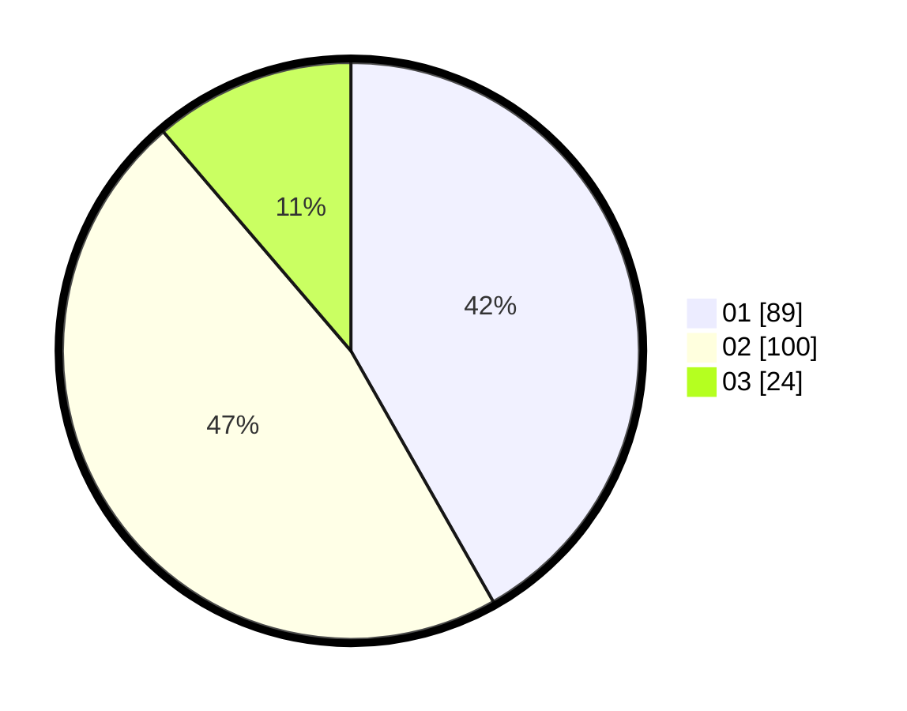

# Hasil

Hasil perolehan suara paslon dapat dilihat pada file paslon-01.txt, paslon-02.txt, dan paslon-03.txt.

Jika tidak ada, artinya data tersebut belum ada pada SIREKAP.

## Perolehan Suara

 * Paslon 01: **89**.
 * Paslon 02: **100**.
 * Paslon 03: **24**.

## Foto C Plano

https://sirekap-obj-formc.kpu.go.id/68f2/pemilu/ppwp/31/73/08/10/01/3173081001182-20240215-011334--3cc49383-adbc-4c4a-8b9e-fa5b1f33ee8f.jpg

https://sirekap-obj-formc.kpu.go.id/68f2/pemilu/ppwp/31/73/08/10/01/3173081001182-20240215-011810--d64ce6be-cd1c-41b6-b9e6-ce375f955031.jpg

https://sirekap-obj-formc.kpu.go.id/68f2/pemilu/ppwp/31/73/08/10/01/3173081001182-20240215-011839--fbc7128d-684a-4c18-bb2e-4bcb3ef747ba.jpg
