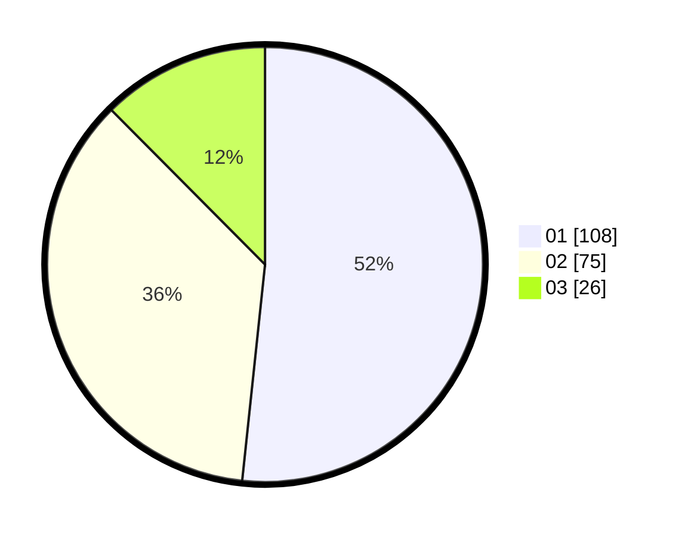

# Hasil

Hasil perolehan suara paslon dapat dilihat pada file paslon-01.txt, paslon-02.txt, dan paslon-03.txt.

Jika tidak ada, artinya data tersebut belum ada pada SIREKAP.

## Perolehan Suara

 * Paslon 01: **108**.
 * Paslon 02: **75**.
 * Paslon 03: **26**.

## Foto C Plano

https://sirekap-obj-formc.kpu.go.id/1df4/pemilu/ppwp/31/73/08/10/01/3173081001184-20240215-110359--e175c6e3-35b0-4c5a-8877-fa54d6dc96d5.jpg

https://sirekap-obj-formc.kpu.go.id/1df4/pemilu/ppwp/31/73/08/10/01/3173081001184-20240215-110618--fd962d3a-0d09-40a4-ab0c-6f73954b2232.jpg

https://sirekap-obj-formc.kpu.go.id/1df4/pemilu/ppwp/31/73/08/10/01/3173081001184-20240215-110752--3771eeaf-1530-42c7-8a42-1920bd560da7.jpg
