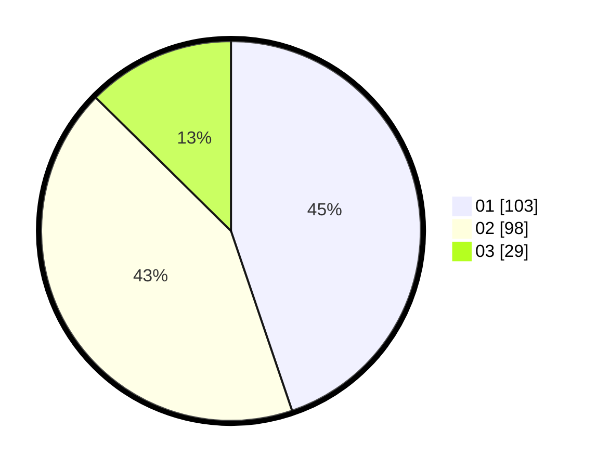

# Hasil

Hasil perolehan suara paslon dapat dilihat pada file paslon-01.txt, paslon-02.txt, dan paslon-03.txt.

Jika tidak ada, artinya data tersebut belum ada pada SIREKAP.

## Perolehan Suara

 * Paslon 01: **103**.
 * Paslon 02: **98**.
 * Paslon 03: **29**.

## Foto C Plano

https://sirekap-obj-formc.kpu.go.id/707f/pemilu/ppwp/31/73/08/10/02/3173081002001-20240216-151334--70557dfe-d5cb-4b8d-b54d-7b4bf4528dec.jpg

https://sirekap-obj-formc.kpu.go.id/707f/pemilu/ppwp/31/73/08/10/02/3173081002001-20240216-151420--900f922c-b8be-4a1e-96ba-c452b4880bad.jpg

https://sirekap-obj-formc.kpu.go.id/707f/pemilu/ppwp/31/73/08/10/02/3173081002001-20240216-151503--21931bcf-ea9b-42b3-a8c8-554a65e7a4ae.jpg
