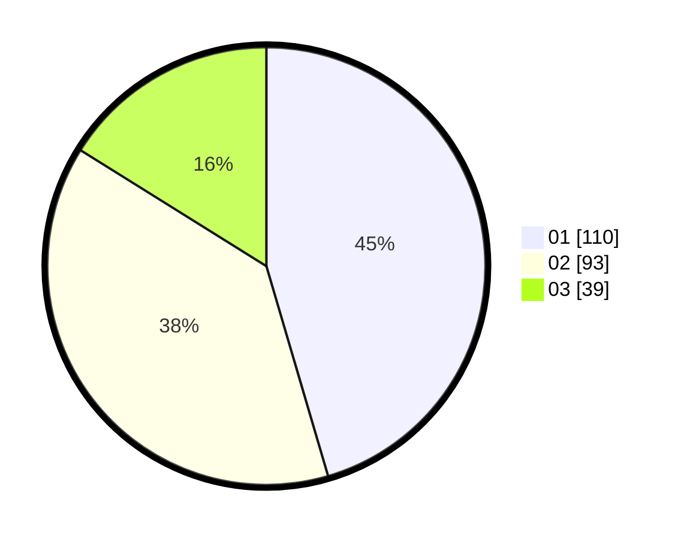

# Hasil

Hasil perolehan suara paslon dapat dilihat pada file paslon-01.txt, paslon-02.txt, dan paslon-03.txt.

Jika tidak ada, artinya data tersebut belum ada pada SIREKAP.

## Perolehan Suara

 * Paslon 01: **110**.
 * Paslon 02: **93**.
 * Paslon 03: **39**.

## Foto C Plano

https://sirekap-obj-formc.kpu.go.id/519e/pemilu/ppwp/31/73/08/10/02/3173081002004-20240216-043038--c71d81a9-cbd3-459e-bd6e-d7731d0fdfb2.jpg

https://sirekap-obj-formc.kpu.go.id/519e/pemilu/ppwp/31/73/08/10/02/3173081002004-20240216-043040--04689a32-e435-442f-8d52-f60180df2dbb.jpg

https://sirekap-obj-formc.kpu.go.id/519e/pemilu/ppwp/31/73/08/10/02/3173081002004-20240216-043039--130b4779-d2e2-4681-95d2-f64fd5999594.jpg

## DATA PEMILIH TETAP

Jumlah pemilih dalam DPT: **287**.
 * L: **151**.
 * P: **136**.

## DATA PENGGUNA HAK PILIH

Jumlah pengguna hak pilih dalam DPT: **238**.
 * L: **127**.
 * P: **111**.

Jumlah pengguna hak pilih dalam DPTb: **2**.
 * L: **0**.
 * P: **2**.

Jumlah pengguna hak pilih dalam DPK: **7**.
 * L: **4**.
 * P: **3**.

Jumlah pengguna hak pilih: **247**.
 * L: **131**.
 * P: **116**.

## JUMLAH SUARA SAH DAN TIDAK SAH

JUMLAH SELURUH SUARA SAH: **242**.

JUMLAH SUARA TIDAK SAH: **5**.

JUMLAH SELURUH SUARA SAH DAN SUARA TIDAK SAH: **247**.
