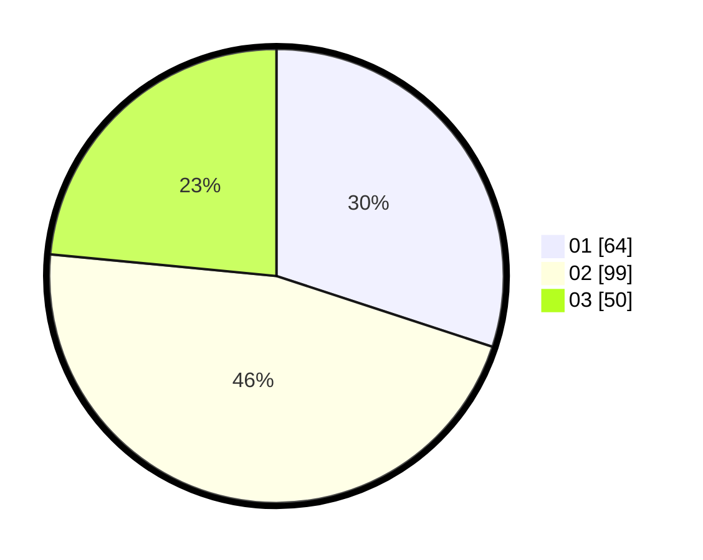

# Hasil

Hasil perolehan suara paslon dapat dilihat pada file paslon-01.txt, paslon-02.txt, dan paslon-03.txt.

Jika tidak ada, artinya data tersebut belum ada pada SIREKAP.

## Perolehan Suara

 * Paslon 01: **64**.
 * Paslon 02: **99**.
 * Paslon 03: **50**.

## Foto C Plano

https://sirekap-obj-formc.kpu.go.id/1965/pemilu/ppwp/31/73/08/10/02/3173081002008-20240214-215908--6f883ce9-b399-4acf-8dbb-3f5b7b06dea3.jpg

https://sirekap-obj-formc.kpu.go.id/1965/pemilu/ppwp/31/73/08/10/02/3173081002008-20240214-220303--da9e506e-a3e1-45ce-b9a3-e513c2aafd19.jpg

https://sirekap-obj-formc.kpu.go.id/1965/pemilu/ppwp/31/73/08/10/02/3173081002008-20240214-220455--098b2924-137f-419b-9cde-3de07f408d3d.jpg
