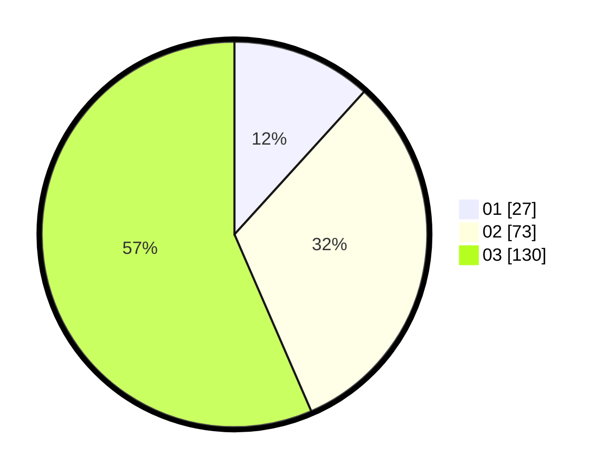

# Hasil

Hasil perolehan suara paslon dapat dilihat pada file paslon-01.txt, paslon-02.txt, dan paslon-03.txt.

Jika tidak ada, artinya data tersebut belum ada pada SIREKAP.

## Perolehan Suara

 * Paslon 01: **27**.
 * Paslon 02: **73**.
 * Paslon 03: **130**.

## Foto C Plano

https://sirekap-obj-formc.kpu.go.id/2029/pemilu/ppwp/31/73/08/10/02/3173081002011-20240214-215815--4b43a4db-cf60-4253-9135-e2f9f1c3fae8.jpg

https://sirekap-obj-formc.kpu.go.id/2029/pemilu/ppwp/31/73/08/10/02/3173081002011-20240214-220000--5e1537b3-cd44-449b-9b7f-527ffb755c7f.jpg

https://sirekap-obj-formc.kpu.go.id/2029/pemilu/ppwp/31/73/08/10/02/3173081002011-20240214-220206--67ec0580-5f2b-4f36-abf7-456925b6630e.jpg
