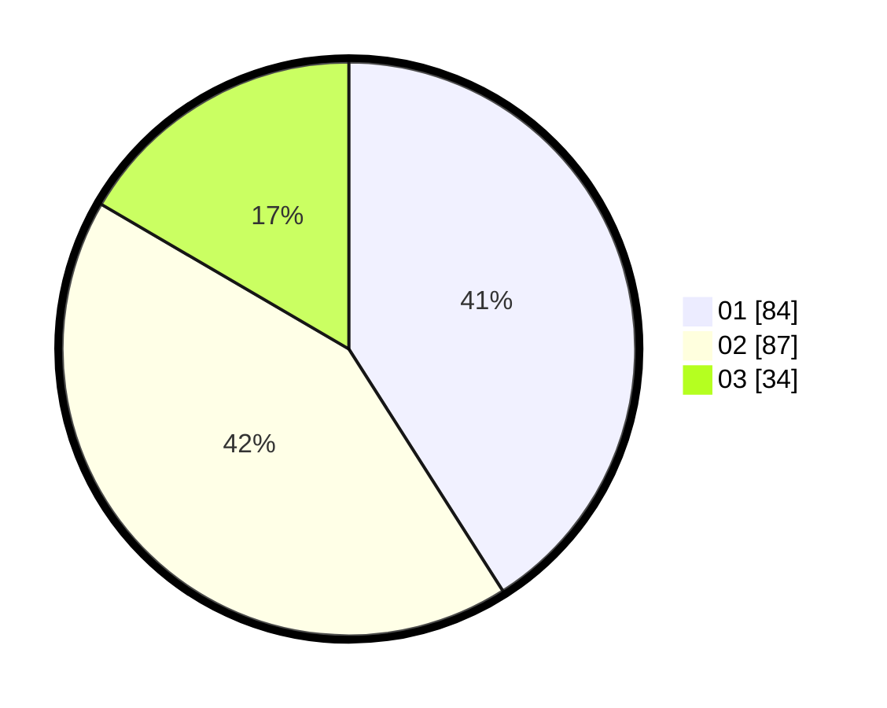

# Hasil

Hasil perolehan suara paslon dapat dilihat pada file paslon-01.txt, paslon-02.txt, dan paslon-03.txt.

Jika tidak ada, artinya data tersebut belum ada pada SIREKAP.

## Perolehan Suara

 * Paslon 01: **84**.
 * Paslon 02: **87**.
 * Paslon 03: **34**.

## Foto C Plano

https://sirekap-obj-formc.kpu.go.id/4b90/pemilu/ppwp/31/73/08/10/02/3173081002014-20240214-203430--02214e2d-7318-418a-80c3-e24fe094f2ae.jpg

https://sirekap-obj-formc.kpu.go.id/4b90/pemilu/ppwp/31/73/08/10/02/3173081002014-20240214-200111--6fb6a49e-add3-41f1-9d31-8f68b493cc39.jpg

https://sirekap-obj-formc.kpu.go.id/4b90/pemilu/ppwp/31/73/08/10/02/3173081002014-20240214-190356--c5878e2e-1aef-4b84-802b-f70a000f79bc.jpg

## DATA PEMILIH TETAP

Jumlah pemilih dalam DPT: **243**.
 * L: **127**.
 * P: **716**.

## DATA PENGGUNA HAK PILIH

Jumlah pengguna hak pilih dalam DPT: **200**.
 * L: **102**.
 * P: **98**.

Jumlah pengguna hak pilih dalam DPTb: **1**.
 * L: **0**.
 * P: **1**.

Jumlah pengguna hak pilih dalam DPK: **4**.
 * L: **3**.
 * P: **1**.

Jumlah pengguna hak pilih: **205**.
 * L: **105**.
 * P: **100**.

## JUMLAH SUARA SAH DAN TIDAK SAH

JUMLAH SELURUH SUARA SAH: **205**.

JUMLAH SUARA TIDAK SAH: **200**.

JUMLAH SELURUH SUARA SAH DAN SUARA TIDAK SAH: **205**.
