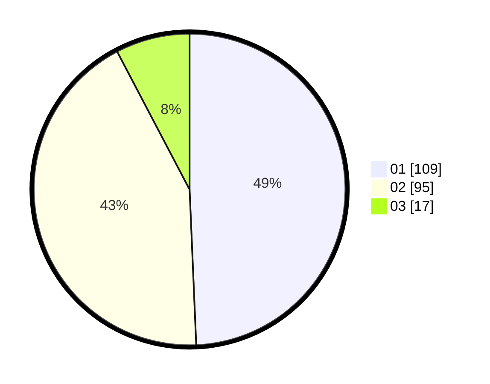

# Hasil

Hasil perolehan suara paslon dapat dilihat pada file paslon-01.txt, paslon-02.txt, dan paslon-03.txt.

Jika tidak ada, artinya data tersebut belum ada pada SIREKAP.

## Perolehan Suara

 * Paslon 01: **109**.
 * Paslon 02: **95**.
 * Paslon 03: **17**.

## Foto C Plano

https://sirekap-obj-formc.kpu.go.id/bfd9/pemilu/ppwp/31/73/08/10/02/3173081002015-20240214-204259--4322a69f-b762-4a9a-9792-289c2036a72e.jpg

https://sirekap-obj-formc.kpu.go.id/bfd9/pemilu/ppwp/31/73/08/10/02/3173081002015-20240216-131401--c9483c05-9530-40ca-b13f-37b69a6c26e1.jpg

https://sirekap-obj-formc.kpu.go.id/bfd9/pemilu/ppwp/31/73/08/10/02/3173081002015-20240216-131400--c0f4c88d-1a1b-4422-9720-09ad69b1fa41.jpg

## DATA PEMILIH TETAP

Jumlah pemilih dalam DPT: **267**.
 * L: **132**.
 * P: **135**.

## DATA PENGGUNA HAK PILIH

Jumlah pengguna hak pilih dalam DPT: **226**.
 * L: **108**.
 * P: **118**.

Jumlah pengguna hak pilih dalam DPTb: **0**.
 * L: **0**.
 * P: **0**.

Jumlah pengguna hak pilih dalam DPK: **1**.
 * L: **1**.
 * P: **0**.

Jumlah pengguna hak pilih: **227**.
 * L: **109**.
 * P: **118**.

## JUMLAH SUARA SAH DAN TIDAK SAH

JUMLAH SELURUH SUARA SAH: **221**.

JUMLAH SUARA TIDAK SAH: **6**.

JUMLAH SELURUH SUARA SAH DAN SUARA TIDAK SAH: **227**.
