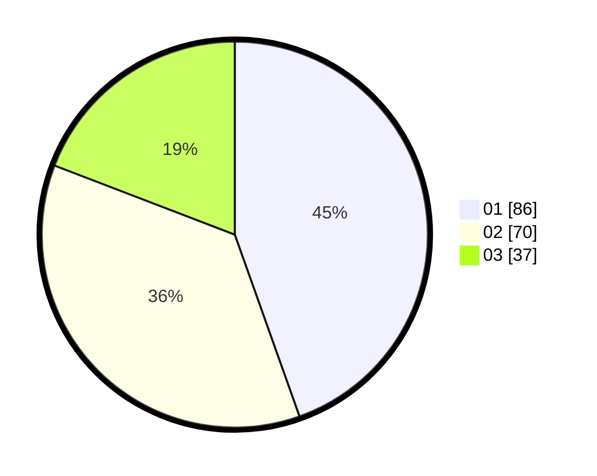

# Hasil

Hasil perolehan suara paslon dapat dilihat pada file paslon-01.txt, paslon-02.txt, dan paslon-03.txt.

Jika tidak ada, artinya data tersebut belum ada pada SIREKAP.

## Perolehan Suara

 * Paslon 01: **86**.
 * Paslon 02: **70**.
 * Paslon 03: **37**.

## Foto C Plano

https://sirekap-obj-formc.kpu.go.id/fbe2/pemilu/ppwp/31/73/08/10/02/3173081002018-20240214-155306--ecd163c1-7114-41b7-af36-d43d06e4d671.jpg

https://sirekap-obj-formc.kpu.go.id/fbe2/pemilu/ppwp/31/73/08/10/02/3173081002018-20240214-155452--0f29be0d-f8e3-4344-873c-d677a13d2553.jpg

https://sirekap-obj-formc.kpu.go.id/fbe2/pemilu/ppwp/31/73/08/10/02/3173081002018-20240214-155603--749ab6d3-f7b3-4f1a-a3bd-a627fcd7bfa1.jpg

## DATA PEMILIH TETAP

Jumlah pemilih dalam DPT: **218**.
 * L: **113**.
 * P: **105**.

## DATA PENGGUNA HAK PILIH

Jumlah pengguna hak pilih dalam DPT: **192**.
 * L: **95**.
 * P: **97**.

Jumlah pengguna hak pilih dalam DPTb: **2**.
 * L: **0**.
 * P: **2**.

Jumlah pengguna hak pilih dalam DPK: **1**.
 * L: **1**.
 * P: **0**.

Jumlah pengguna hak pilih: **195**.
 * L: **96**.
 * P: **99**.

## JUMLAH SUARA SAH DAN TIDAK SAH

JUMLAH SELURUH SUARA SAH: **193**.

JUMLAH SUARA TIDAK SAH: **2**.

JUMLAH SELURUH SUARA SAH DAN SUARA TIDAK SAH: **195**.
