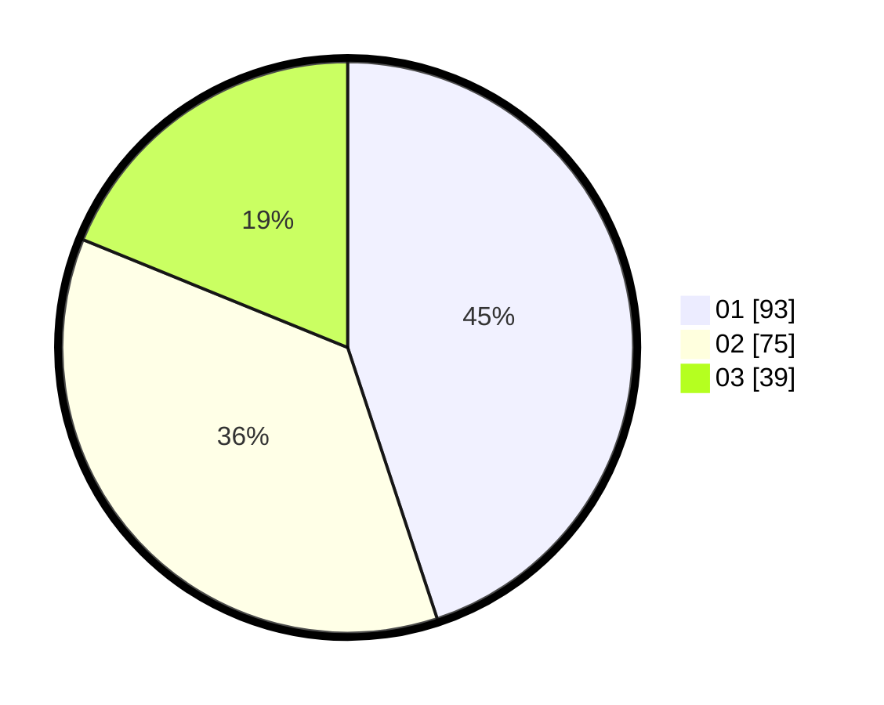

# Hasil

Hasil perolehan suara paslon dapat dilihat pada file paslon-01.txt, paslon-02.txt, dan paslon-03.txt.

Jika tidak ada, artinya data tersebut belum ada pada SIREKAP.

## Perolehan Suara

 * Paslon 01: **93**.
 * Paslon 02: **75**.
 * Paslon 03: **39**.

## Foto C Plano

https://sirekap-obj-formc.kpu.go.id/1666/pemilu/ppwp/31/73/08/10/02/3173081002023-20240214-185449--a76d09a0-5e09-46b5-9d07-887e10c71e08.jpg

https://sirekap-obj-formc.kpu.go.id/1666/pemilu/ppwp/31/73/08/10/02/3173081002023-20240214-220908--975898b5-ffc3-4910-a160-ccf567ffabf6.jpg

https://sirekap-obj-formc.kpu.go.id/1666/pemilu/ppwp/31/73/08/10/02/3173081002023-20240214-215703--4cce5460-7033-494e-8c6f-92ab263fdee2.jpg

## DATA PEMILIH TETAP

Jumlah pemilih dalam DPT: **265**.
 * L: **136**.
 * P: **129**.

## DATA PENGGUNA HAK PILIH

Jumlah pengguna hak pilih dalam DPT: **207**.
 * L: **102**.
 * P: **105**.

Jumlah pengguna hak pilih dalam DPTb: **2**.
 * L: **1**.
 * P: **1**.

Jumlah pengguna hak pilih dalam DPK: **0**.
 * L: **0**.
 * P: **0**.

Jumlah pengguna hak pilih: **209**.
 * L: **103**.
 * P: **106**.

## JUMLAH SUARA SAH DAN TIDAK SAH

JUMLAH SELURUH SUARA SAH: **207**.

JUMLAH SUARA TIDAK SAH: **2**.

JUMLAH SELURUH SUARA SAH DAN SUARA TIDAK SAH: **209**.
