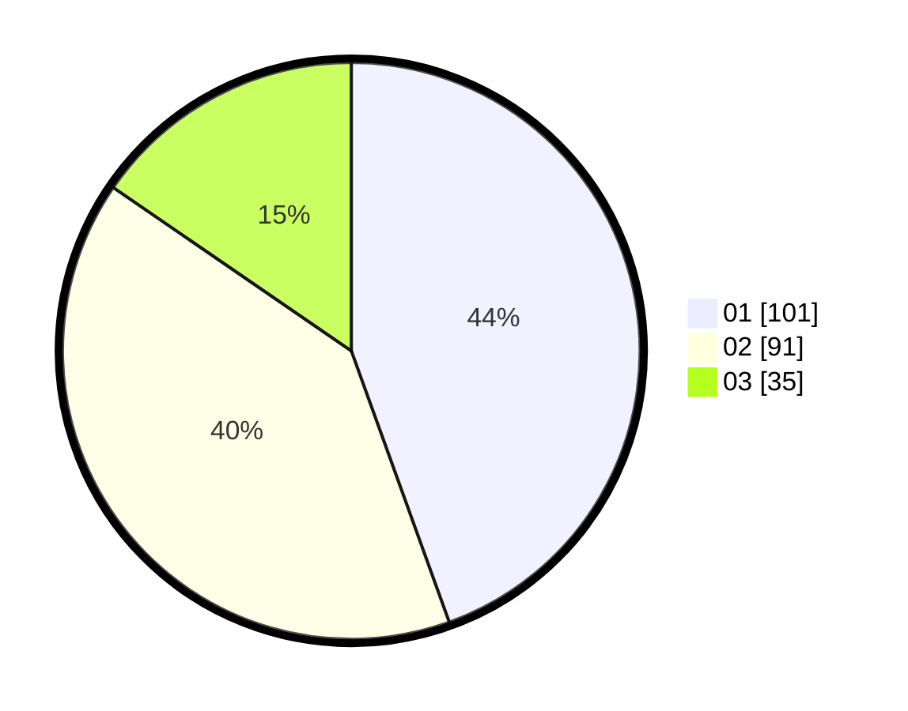

# Hasil

Hasil perolehan suara paslon dapat dilihat pada file paslon-01.txt, paslon-02.txt, dan paslon-03.txt.

Jika tidak ada, artinya data tersebut belum ada pada SIREKAP.

## Perolehan Suara

 * Paslon 01: **101**.
 * Paslon 02: **91**.
 * Paslon 03: **35**.

## Foto C Plano

https://sirekap-obj-formc.kpu.go.id/52f0/pemilu/ppwp/31/73/08/10/02/3173081002028-20240214-210219--086ccec5-90f5-4c05-bf6a-b45b4c9337fd.jpg

https://sirekap-obj-formc.kpu.go.id/52f0/pemilu/ppwp/31/73/08/10/02/3173081002028-20240214-210806--eff1bc89-efc9-4fd5-8b75-558c5a92dcbe.jpg

https://sirekap-obj-formc.kpu.go.id/52f0/pemilu/ppwp/31/73/08/10/02/3173081002028-20240214-210709--425102f6-b533-4aec-9ce2-a4718f66ccd3.jpg
