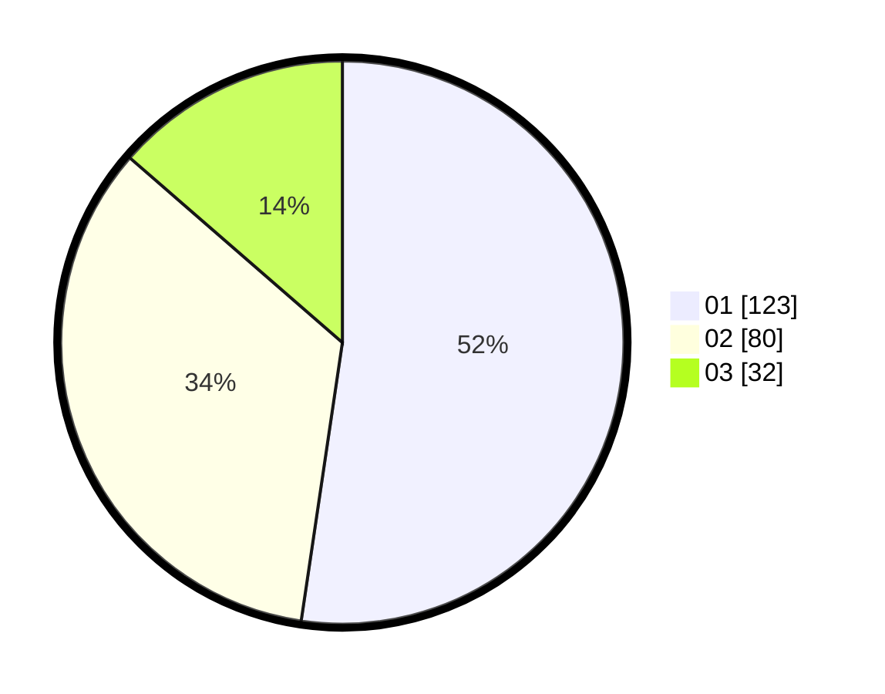

# Hasil

Hasil perolehan suara paslon dapat dilihat pada file paslon-01.txt, paslon-02.txt, dan paslon-03.txt.

Jika tidak ada, artinya data tersebut belum ada pada SIREKAP.

## Perolehan Suara

 * Paslon 01: **123**.
 * Paslon 02: **80**.
 * Paslon 03: **32**.

## Foto C Plano

https://sirekap-obj-formc.kpu.go.id/c755/pemilu/ppwp/31/73/08/10/02/3173081002031-20240214-233609--49f5881c-fa67-486a-940c-3d81450e39e5.jpg

https://sirekap-obj-formc.kpu.go.id/c755/pemilu/ppwp/31/73/08/10/02/3173081002031-20240214-233627--d27c8c56-51aa-4e5c-b6b9-af46d7b76220.jpg

https://sirekap-obj-formc.kpu.go.id/c755/pemilu/ppwp/31/73/08/10/02/3173081002031-20240214-233632--fba06b49-e783-4246-be4a-69d776b62c12.jpg
