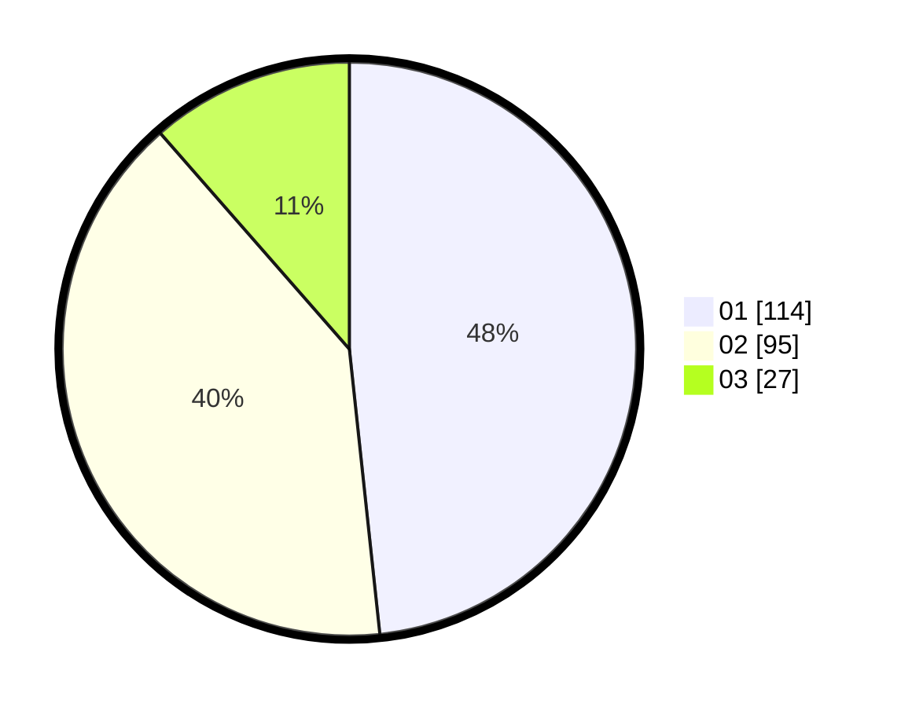

# Hasil

Hasil perolehan suara paslon dapat dilihat pada file paslon-01.txt, paslon-02.txt, dan paslon-03.txt.

Jika tidak ada, artinya data tersebut belum ada pada SIREKAP.

## Perolehan Suara

 * Paslon 01: **114**.
 * Paslon 02: **95**.
 * Paslon 03: **27**.

## Foto C Plano

https://sirekap-obj-formc.kpu.go.id/256b/pemilu/ppwp/31/73/08/10/02/3173081002032-20240214-191630--941a11c7-f5ba-4237-b368-0bc46638b98b.jpg

https://sirekap-obj-formc.kpu.go.id/256b/pemilu/ppwp/31/73/08/10/02/3173081002032-20240214-193110--7ce68895-927f-4e15-841d-009781ef65a3.jpg

https://sirekap-obj-formc.kpu.go.id/256b/pemilu/ppwp/31/73/08/10/02/3173081002032-20240214-193229--bedf3a21-c26d-4c36-9dce-f0bb8f923d57.jpg
