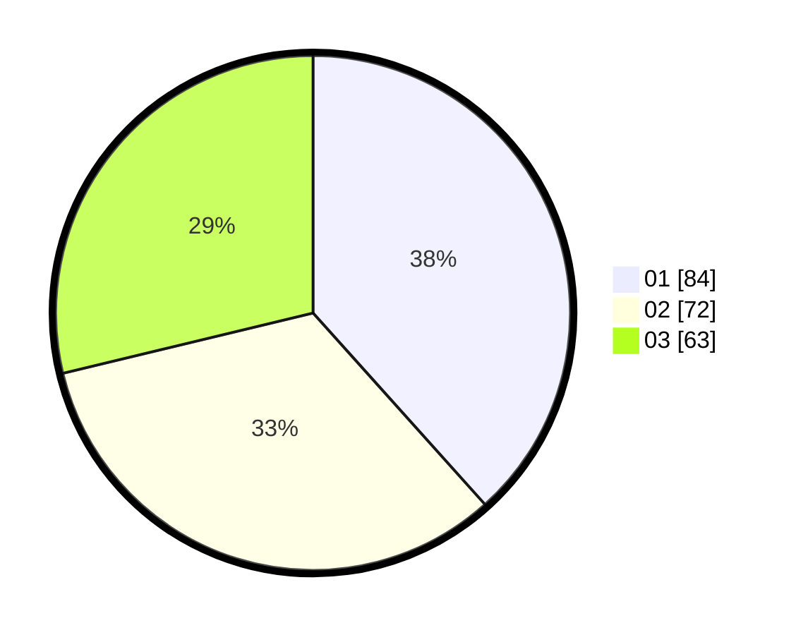

# Hasil

Hasil perolehan suara paslon dapat dilihat pada file paslon-01.txt, paslon-02.txt, dan paslon-03.txt.

Jika tidak ada, artinya data tersebut belum ada pada SIREKAP.

## Perolehan Suara

 * Paslon 01: **84**.
 * Paslon 02: **72**.
 * Paslon 03: **63**.

## Foto C Plano

https://sirekap-obj-formc.kpu.go.id/860f/pemilu/ppwp/31/73/08/10/02/3173081002040-20240214-200049--4e9747c5-4e7c-44f0-aaed-610ce339dedb.jpg

https://sirekap-obj-formc.kpu.go.id/860f/pemilu/ppwp/31/73/08/10/02/3173081002040-20240214-200104--5790b512-bb56-40fc-92c7-8dbecb9d638a.jpg

https://sirekap-obj-formc.kpu.go.id/860f/pemilu/ppwp/31/73/08/10/02/3173081002040-20240214-200118--437a13e5-9ed3-4508-a95d-b04ed0e2f5b7.jpg

## DATA PEMILIH TETAP

Jumlah pemilih dalam DPT: **285**.
 * L: **139**.
 * P: **146**.

## DATA PENGGUNA HAK PILIH

Jumlah pengguna hak pilih dalam DPT: **224**.
 * L: **106**.
 * P: **118**.

Jumlah pengguna hak pilih dalam DPTb: **0**.
 * L: **0**.
 * P: **0**.

Jumlah pengguna hak pilih dalam DPK: **3**.
 * L: **2**.
 * P: **1**.

Jumlah pengguna hak pilih: **227**.
 * L: **108**.
 * P: **119**.

## JUMLAH SUARA SAH DAN TIDAK SAH

JUMLAH SELURUH SUARA SAH: **219**.

JUMLAH SUARA TIDAK SAH: **8**.

JUMLAH SELURUH SUARA SAH DAN SUARA TIDAK SAH: **227**.
