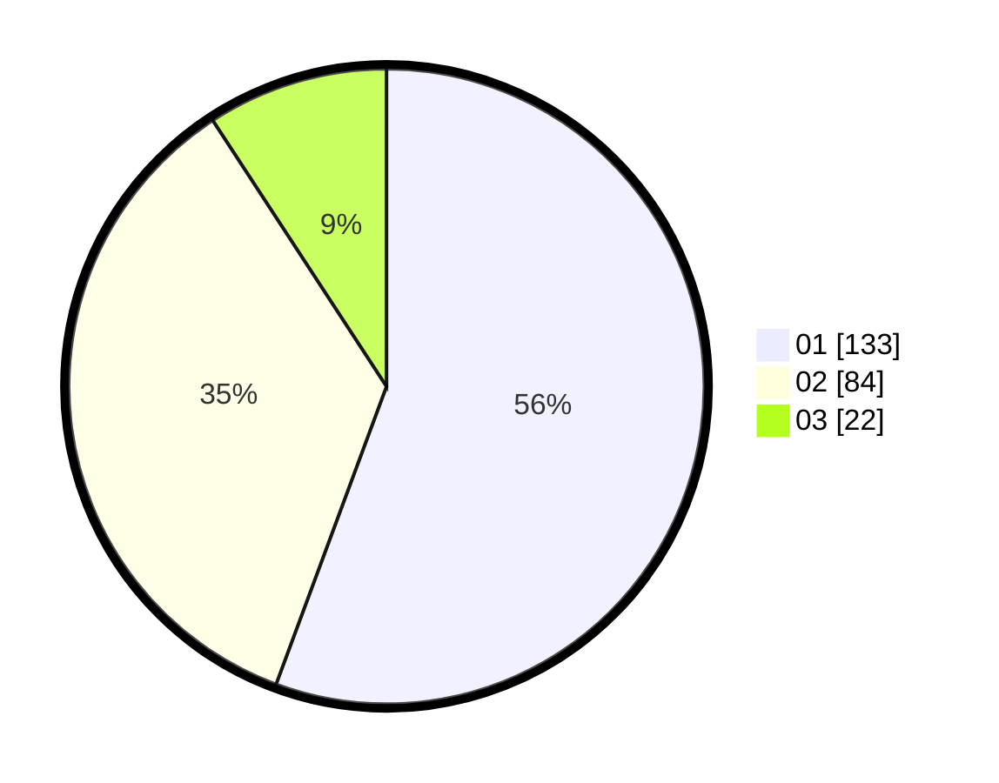

# Hasil

Hasil perolehan suara paslon dapat dilihat pada file paslon-01.txt, paslon-02.txt, dan paslon-03.txt.

Jika tidak ada, artinya data tersebut belum ada pada SIREKAP.

## Perolehan Suara

 * Paslon 01: **133**.
 * Paslon 02: **84**.
 * Paslon 03: **22**.

## Foto C Plano

https://sirekap-obj-formc.kpu.go.id/8c01/pemilu/ppwp/31/73/08/10/02/3173081002043-20240214-204933--30bd24bd-da38-4813-be39-4d78e957ffbd.jpg

https://sirekap-obj-formc.kpu.go.id/8c01/pemilu/ppwp/31/73/08/10/02/3173081002043-20240214-205057--6809dc0d-63ef-400d-aa43-a95c27164639.jpg

https://sirekap-obj-formc.kpu.go.id/8c01/pemilu/ppwp/31/73/08/10/02/3173081002043-20240214-205157--c095a955-745c-4b5d-afb0-dc910446fd77.jpg

## DATA PEMILIH TETAP

Jumlah pemilih dalam DPT: **280**.
 * L: **139**.
 * P: **141**.

## DATA PENGGUNA HAK PILIH

Jumlah pengguna hak pilih dalam DPT: **227**.
 * L: **109**.
 * P: **118**.

Jumlah pengguna hak pilih dalam DPTb: **9**.
 * L: **4**.
 * P: **5**.

Jumlah pengguna hak pilih dalam DPK: **7**.
 * L: **4**.
 * P: **3**.

Jumlah pengguna hak pilih: **243**.
 * L: **117**.
 * P: **126**.

## JUMLAH SUARA SAH DAN TIDAK SAH

JUMLAH SELURUH SUARA SAH: **239**.

JUMLAH SUARA TIDAK SAH: **4**.

JUMLAH SELURUH SUARA SAH DAN SUARA TIDAK SAH: **243**.
