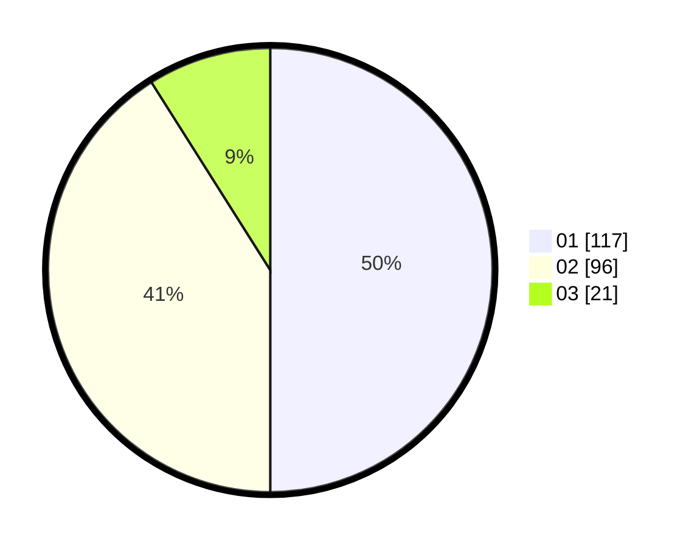

# Hasil

Hasil perolehan suara paslon dapat dilihat pada file paslon-01.txt, paslon-02.txt, dan paslon-03.txt.

Jika tidak ada, artinya data tersebut belum ada pada SIREKAP.

## Perolehan Suara

 * Paslon 01: **117**.
 * Paslon 02: **96**.
 * Paslon 03: **21**.

## Foto C Plano

https://sirekap-obj-formc.kpu.go.id/94dd/pemilu/ppwp/31/73/08/10/02/3173081002044-20240214-220754--3267862e-3322-4af7-b088-ca370e8dda12.jpg

https://sirekap-obj-formc.kpu.go.id/94dd/pemilu/ppwp/31/73/08/10/02/3173081002044-20240214-220704--fdd150ab-b4c2-4ec4-9dde-88260d484d61.jpg

https://sirekap-obj-formc.kpu.go.id/94dd/pemilu/ppwp/31/73/08/10/02/3173081002044-20240214-220743--2242581a-9847-4556-abec-4d21d0ca293e.jpg
