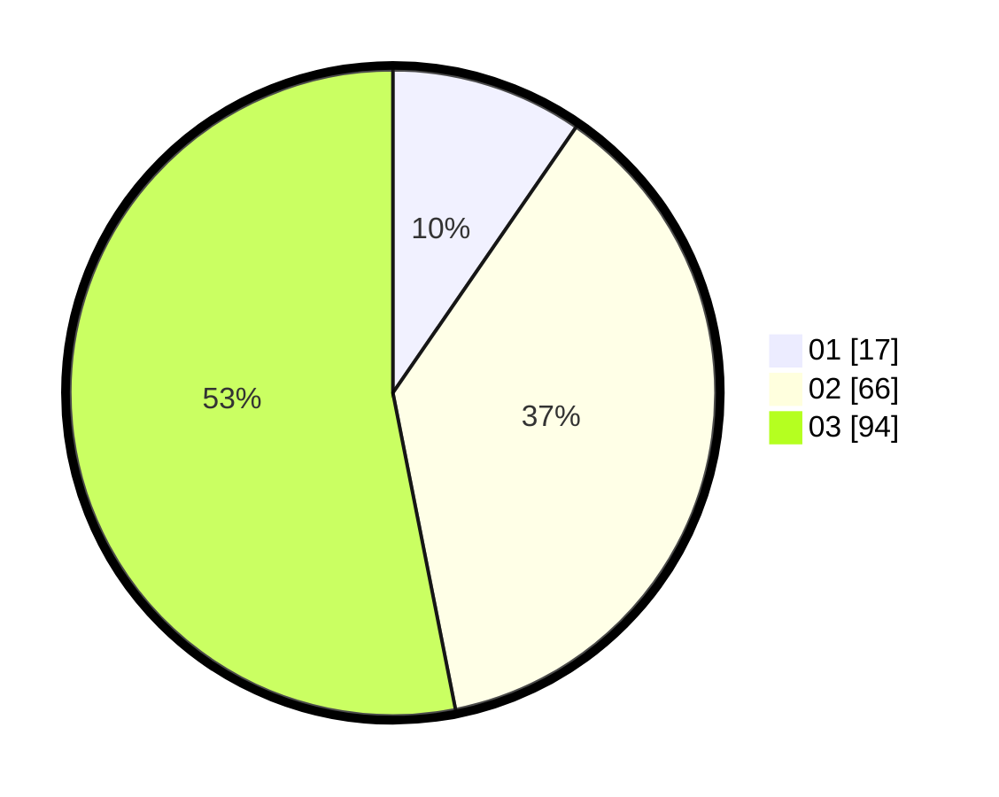

# Hasil

Hasil perolehan suara paslon dapat dilihat pada file paslon-01.txt, paslon-02.txt, dan paslon-03.txt.

Jika tidak ada, artinya data tersebut belum ada pada SIREKAP.

## Perolehan Suara

 * Paslon 01: **17**.
 * Paslon 02: **66**.
 * Paslon 03: **94**.

## Foto C Plano

https://sirekap-obj-formc.kpu.go.id/9ac2/pemilu/ppwp/31/73/08/10/02/3173081002045-20240214-230533--a93744cb-692d-4c39-8a51-7ced9393725f.jpg

https://sirekap-obj-formc.kpu.go.id/9ac2/pemilu/ppwp/31/73/08/10/02/3173081002045-20240214-230836--3e948add-7fe5-47f0-ac10-b29b6109c54f.jpg

https://sirekap-obj-formc.kpu.go.id/9ac2/pemilu/ppwp/31/73/08/10/02/3173081002045-20240214-231318--9a8af9dd-8245-457d-a1a6-54949e546936.jpg
