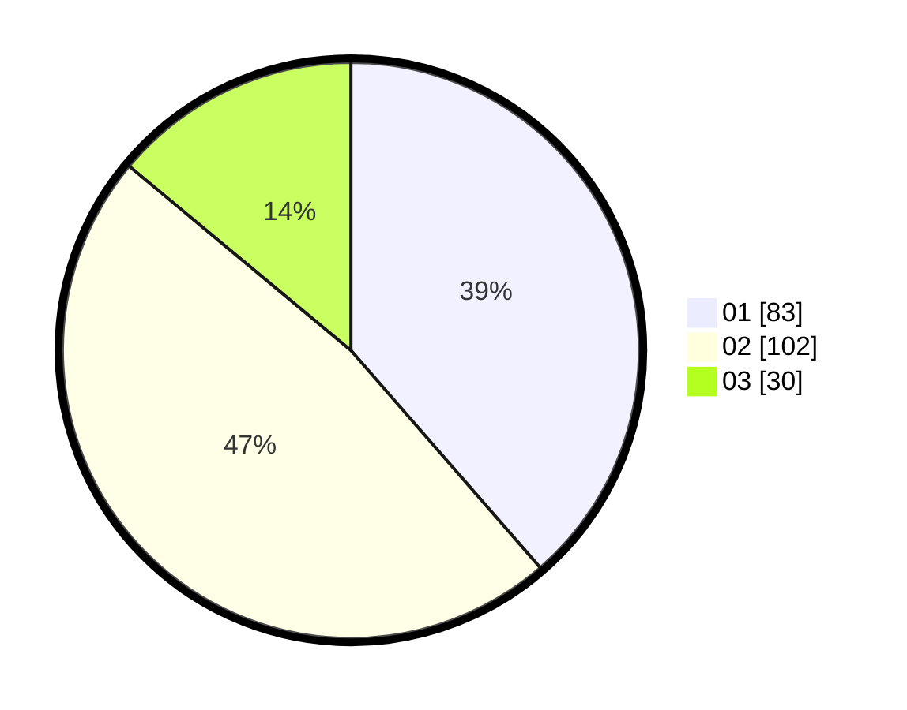

# Hasil

Hasil perolehan suara paslon dapat dilihat pada file paslon-01.txt, paslon-02.txt, dan paslon-03.txt.

Jika tidak ada, artinya data tersebut belum ada pada SIREKAP.

## Perolehan Suara

 * Paslon 01: **83**.
 * Paslon 02: **102**.
 * Paslon 03: **30**.

## Foto C Plano

https://sirekap-obj-formc.kpu.go.id/fbb9/pemilu/ppwp/31/73/08/10/02/3173081002048-20240214-192446--594a548d-666b-4085-8fb3-050a989e16d0.jpg

https://sirekap-obj-formc.kpu.go.id/fbb9/pemilu/ppwp/31/73/08/10/02/3173081002048-20240214-194056--9a8b0a43-5bb5-4d5c-8bf1-899a6aa772f8.jpg

https://sirekap-obj-formc.kpu.go.id/fbb9/pemilu/ppwp/31/73/08/10/02/3173081002048-20240214-195153--08238afd-9241-412a-b9e7-59b842be69b3.jpg
