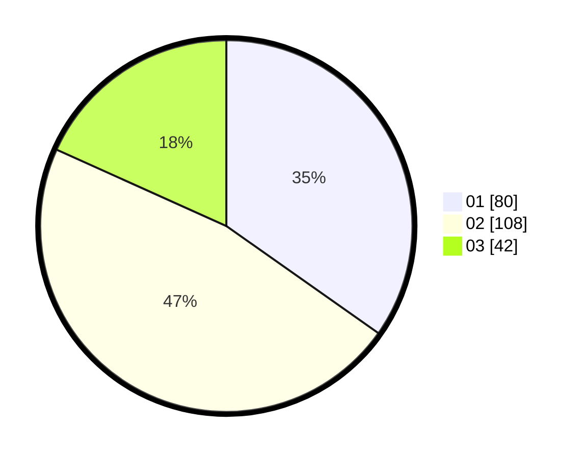

# Hasil

Hasil perolehan suara paslon dapat dilihat pada file paslon-01.txt, paslon-02.txt, dan paslon-03.txt.

Jika tidak ada, artinya data tersebut belum ada pada SIREKAP.

## Perolehan Suara

 * Paslon 01: **80**.
 * Paslon 02: **108**.
 * Paslon 03: **42**.

## Foto C Plano

https://sirekap-obj-formc.kpu.go.id/3551/pemilu/ppwp/31/73/08/10/02/3173081002052-20240214-230223--7819cd9d-64e6-47d1-b94f-874a6a3f061b.jpg

https://sirekap-obj-formc.kpu.go.id/3551/pemilu/ppwp/31/73/08/10/02/3173081002052-20240214-230021--8b0ba66b-b4ee-4dc2-aebf-80d231a7bedb.jpg

https://sirekap-obj-formc.kpu.go.id/3551/pemilu/ppwp/31/73/08/10/02/3173081002052-20240214-225002--d6fc27c6-3258-41c9-a5d5-d2118522051d.jpg
