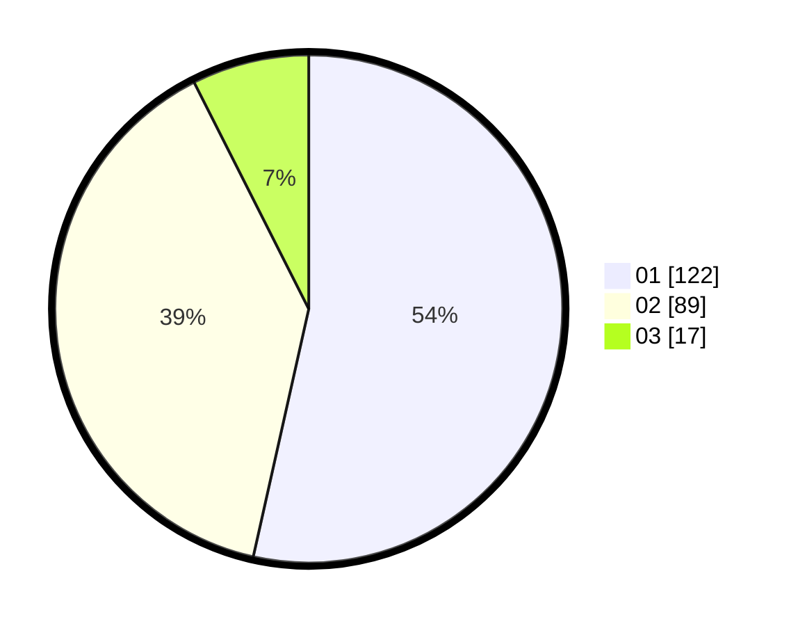

# Hasil

Hasil perolehan suara paslon dapat dilihat pada file paslon-01.txt, paslon-02.txt, dan paslon-03.txt.

Jika tidak ada, artinya data tersebut belum ada pada SIREKAP.

## Perolehan Suara

 * Paslon 01: **122**.
 * Paslon 02: **89**.
 * Paslon 03: **17**.

## Foto C Plano

https://sirekap-obj-formc.kpu.go.id/2465/pemilu/ppwp/31/73/08/10/02/3173081002055-20240214-220919--485fd8d9-1f42-4a38-8da3-ee9758e3b58f.jpg

https://sirekap-obj-formc.kpu.go.id/2465/pemilu/ppwp/31/73/08/10/02/3173081002055-20240214-221034--bfabbccb-3373-40b0-80b1-7ac06cdfb5bf.jpg

https://sirekap-obj-formc.kpu.go.id/2465/pemilu/ppwp/31/73/08/10/02/3173081002055-20240214-220812--097be34a-b73c-4ed3-95ac-d21be1ab948c.jpg
