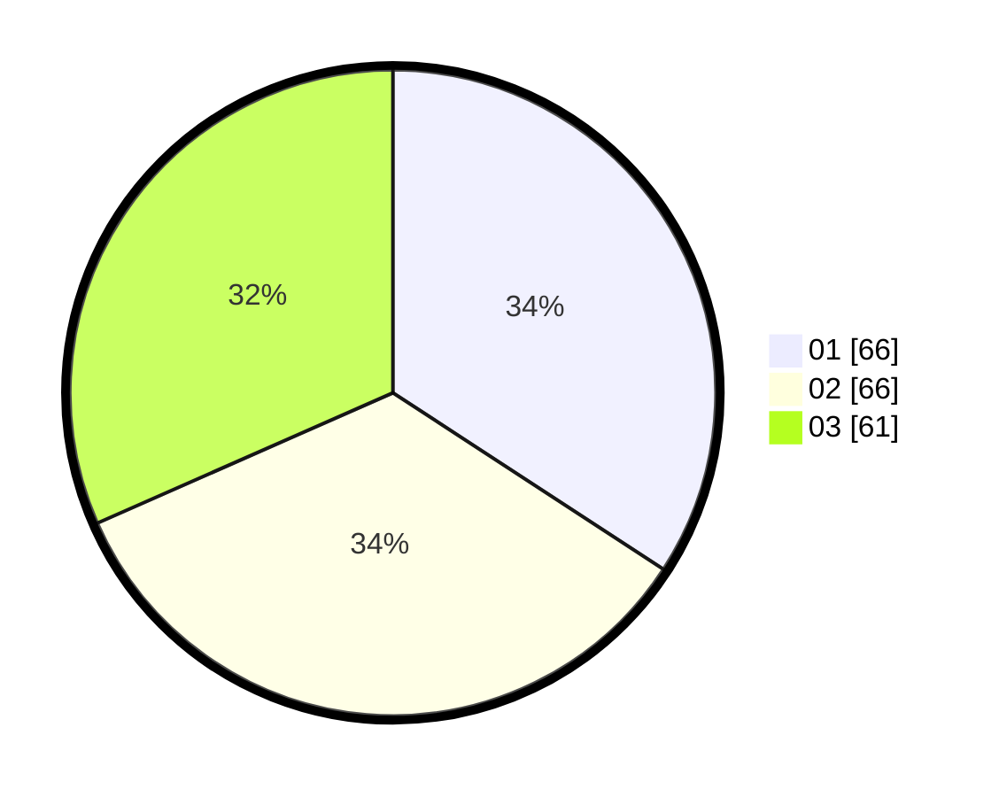

# Hasil

Hasil perolehan suara paslon dapat dilihat pada file paslon-01.txt, paslon-02.txt, dan paslon-03.txt.

Jika tidak ada, artinya data tersebut belum ada pada SIREKAP.

## Perolehan Suara

 * Paslon 01: **66**.
 * Paslon 02: **66**.
 * Paslon 03: **61**.

## Foto C Plano

https://sirekap-obj-formc.kpu.go.id/fbe3/pemilu/ppwp/31/73/08/10/02/3173081002057-20240215-213654--c69f4564-4f73-4014-9c34-55201b12df06.jpg

https://sirekap-obj-formc.kpu.go.id/fbe3/pemilu/ppwp/31/73/08/10/02/3173081002057-20240215-213656--5522f555-6c88-442c-b626-94c57d9d9e33.jpg

https://sirekap-obj-formc.kpu.go.id/fbe3/pemilu/ppwp/31/73/08/10/02/3173081002057-20240215-213655--af3b26e1-2c2d-47df-8574-91dfe2aa6633.jpg

## DATA PEMILIH TETAP

Jumlah pemilih dalam DPT: **0**.
 * L: **0**.
 * P: **0**.

## DATA PENGGUNA HAK PILIH

Jumlah pengguna hak pilih dalam DPT: **0**.
 * L: **0**.
 * P: **0**.

Jumlah pengguna hak pilih dalam DPTb: **0**.
 * L: **0**.
 * P: **0**.

Jumlah pengguna hak pilih dalam DPK: **0**.
 * L: **0**.
 * P: **0**.

Jumlah pengguna hak pilih: **0**.
 * L: **0**.
 * P: **0**.

## JUMLAH SUARA SAH DAN TIDAK SAH

JUMLAH SELURUH SUARA SAH: **193**.

JUMLAH SUARA TIDAK SAH: **2**.

JUMLAH SELURUH SUARA SAH DAN SUARA TIDAK SAH: **195**.
