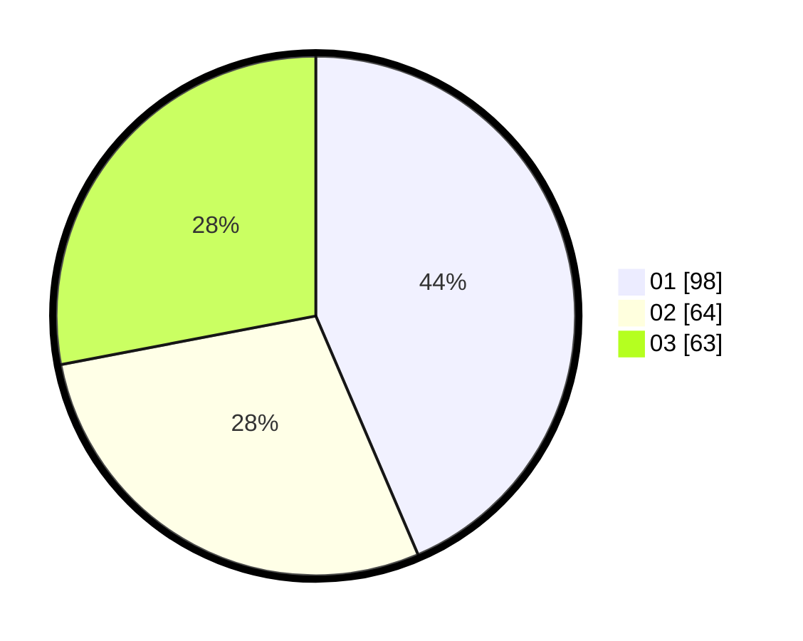

# Hasil

Hasil perolehan suara paslon dapat dilihat pada file paslon-01.txt, paslon-02.txt, dan paslon-03.txt.

Jika tidak ada, artinya data tersebut belum ada pada SIREKAP.

## Perolehan Suara

 * Paslon 01: **98**.
 * Paslon 02: **64**.
 * Paslon 03: **63**.

## Foto C Plano

https://sirekap-obj-formc.kpu.go.id/886e/pemilu/ppwp/31/73/08/10/02/3173081002058-20240214-200529--9599d825-1e10-43a7-a3b9-a8cfbbd01a89.jpg

https://sirekap-obj-formc.kpu.go.id/886e/pemilu/ppwp/31/73/08/10/02/3173081002058-20240216-012400--5343f142-5cd0-4a06-9985-279bdf822419.jpg

https://sirekap-obj-formc.kpu.go.id/886e/pemilu/ppwp/31/73/08/10/02/3173081002058-20240216-012359--80601366-12f7-4413-8d8d-d2729d698d76.jpg

## DATA PEMILIH TETAP

Jumlah pemilih dalam DPT: **201**.
 * L: **86**.
 * P: **115**.

## DATA PENGGUNA HAK PILIH

Jumlah pengguna hak pilih dalam DPT: **201**.
 * L: **86**.
 * P: **115**.

Jumlah pengguna hak pilih dalam DPTb: **2**.
 * L: **1**.
 * P: **1**.

Jumlah pengguna hak pilih dalam DPK: **22**.
 * L: **5**.
 * P: **17**.

Jumlah pengguna hak pilih: **225**.
 * L: **92**.
 * P: **133**.

## JUMLAH SUARA SAH DAN TIDAK SAH

JUMLAH SELURUH SUARA SAH: **225**.

JUMLAH SUARA TIDAK SAH: **0**.

JUMLAH SELURUH SUARA SAH DAN SUARA TIDAK SAH: **225**.
