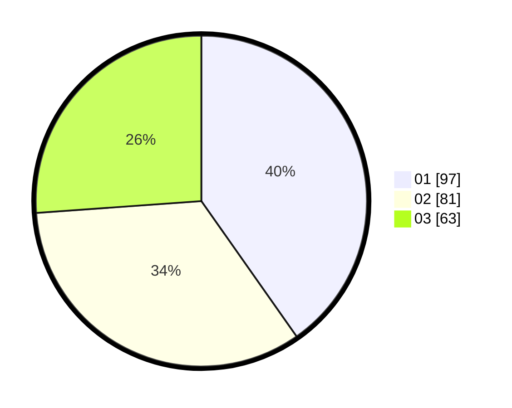

# Hasil

Hasil perolehan suara paslon dapat dilihat pada file paslon-01.txt, paslon-02.txt, dan paslon-03.txt.

Jika tidak ada, artinya data tersebut belum ada pada SIREKAP.

## Perolehan Suara

 * Paslon 01: **97**.
 * Paslon 02: **81**.
 * Paslon 03: **63**.

## Foto C Plano

https://sirekap-obj-formc.kpu.go.id/3097/pemilu/ppwp/31/73/08/10/02/3173081002063-20240216-035329--e1b10ae4-96eb-429b-a995-43600492d329.jpg

https://sirekap-obj-formc.kpu.go.id/3097/pemilu/ppwp/31/73/08/10/02/3173081002063-20240216-035331--6c86c556-8c64-42eb-aa45-88ead16227ed.jpg

https://sirekap-obj-formc.kpu.go.id/3097/pemilu/ppwp/31/73/08/10/02/3173081002063-20240216-035330--7e817c41-e4be-4c34-99c2-f646ee70ac32.jpg

## DATA PEMILIH TETAP

Jumlah pemilih dalam DPT: **289**.
 * L: **138**.
 * P: **151**.

## DATA PENGGUNA HAK PILIH

Jumlah pengguna hak pilih dalam DPT: **235**.
 * L: **112**.
 * P: **123**.

Jumlah pengguna hak pilih dalam DPTb: **7**.
 * L: **2**.
 * P: **5**.

Jumlah pengguna hak pilih dalam DPK: **1**.
 * L: **0**.
 * P: **1**.

Jumlah pengguna hak pilih: **243**.
 * L: **114**.
 * P: **129**.

## JUMLAH SUARA SAH DAN TIDAK SAH

JUMLAH SELURUH SUARA SAH: **241**.

JUMLAH SUARA TIDAK SAH: **2**.

JUMLAH SELURUH SUARA SAH DAN SUARA TIDAK SAH: **243**.
