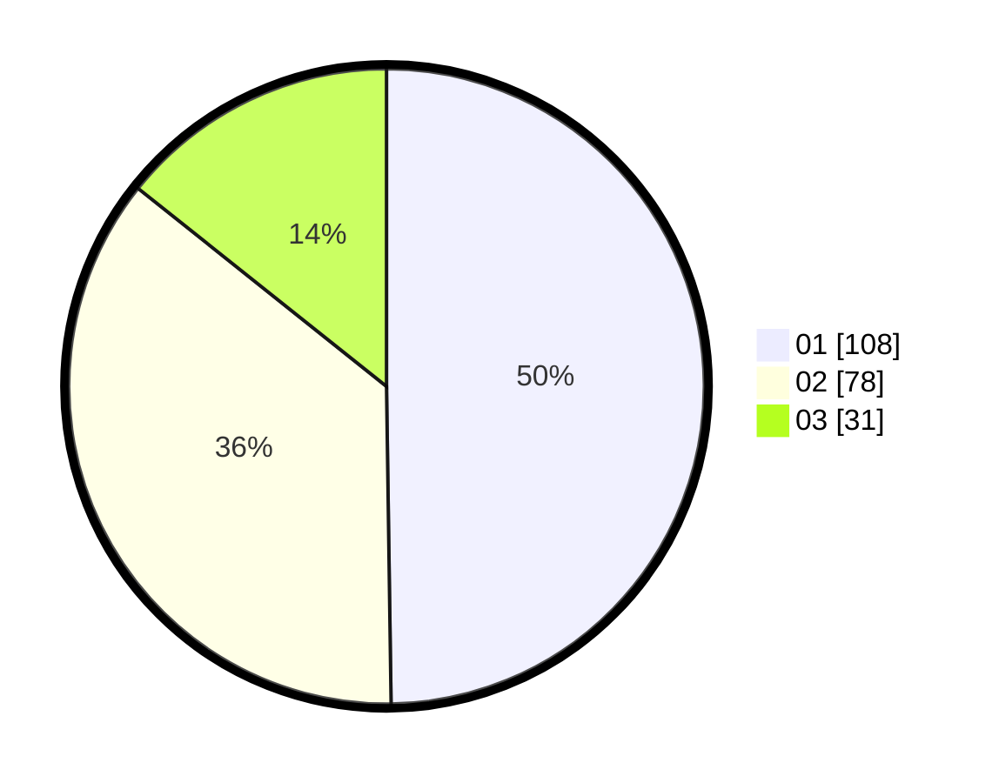

# Hasil

Hasil perolehan suara paslon dapat dilihat pada file paslon-01.txt, paslon-02.txt, dan paslon-03.txt.

Jika tidak ada, artinya data tersebut belum ada pada SIREKAP.

## Perolehan Suara

 * Paslon 01: **108**.
 * Paslon 02: **78**.
 * Paslon 03: **31**.

## Foto C Plano

https://sirekap-obj-formc.kpu.go.id/ba36/pemilu/ppwp/31/73/08/10/02/3173081002064-20240216-042704--7014a581-7ca7-45e0-8f95-e7ecb7fa2290.jpg

https://sirekap-obj-formc.kpu.go.id/ba36/pemilu/ppwp/31/73/08/10/02/3173081002064-20240216-042710--e5ac0224-faa6-42b7-a067-c24717eb1879.jpg

https://sirekap-obj-formc.kpu.go.id/ba36/pemilu/ppwp/31/73/08/10/02/3173081002064-20240216-042709--3e1e1610-8ba4-4e4b-9ce8-034e65ff751f.jpg

## DATA PEMILIH TETAP

Jumlah pemilih dalam DPT: **289**.
 * L: **152**.
 * P: **137**.

## DATA PENGGUNA HAK PILIH

Jumlah pengguna hak pilih dalam DPT: **224**.
 * L: **113**.
 * P: **111**.

Jumlah pengguna hak pilih dalam DPTb: **0**.
 * L: **0**.
 * P: **0**.

Jumlah pengguna hak pilih dalam DPK: **0**.
 * L: **0**.
 * P: **0**.

Jumlah pengguna hak pilih: **224**.
 * L: **113**.
 * P: **111**.

## JUMLAH SUARA SAH DAN TIDAK SAH

JUMLAH SELURUH SUARA SAH: **217**.

JUMLAH SUARA TIDAK SAH: **7**.

JUMLAH SELURUH SUARA SAH DAN SUARA TIDAK SAH: **224**.
