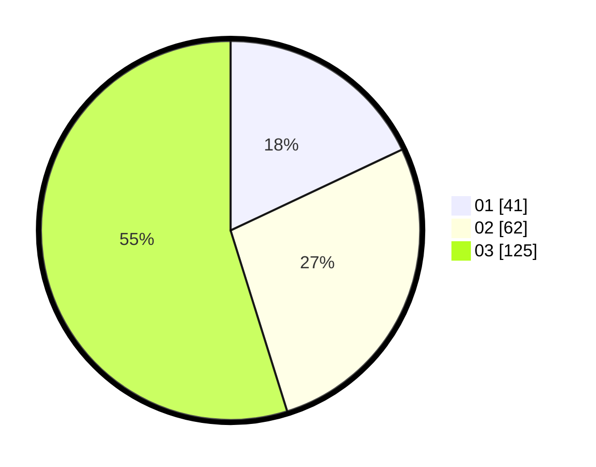

# Hasil

Hasil perolehan suara paslon dapat dilihat pada file paslon-01.txt, paslon-02.txt, dan paslon-03.txt.

Jika tidak ada, artinya data tersebut belum ada pada SIREKAP.

## Perolehan Suara

 * Paslon 01: **41**.
 * Paslon 02: **62**.
 * Paslon 03: **125**.

## Foto C Plano

https://sirekap-obj-formc.kpu.go.id/e645/pemilu/ppwp/31/73/08/10/02/3173081002071-20240214-234316--05b91ee6-d365-485c-8f3d-13fcba4182ad.jpg

https://sirekap-obj-formc.kpu.go.id/e645/pemilu/ppwp/31/73/08/10/02/3173081002071-20240214-234347--87fe8c53-eb56-4caf-aee7-3e826d70c127.jpg

https://sirekap-obj-formc.kpu.go.id/e645/pemilu/ppwp/31/73/08/10/02/3173081002071-20240214-234427--000f737f-223f-4bdd-869d-13752292c081.jpg
