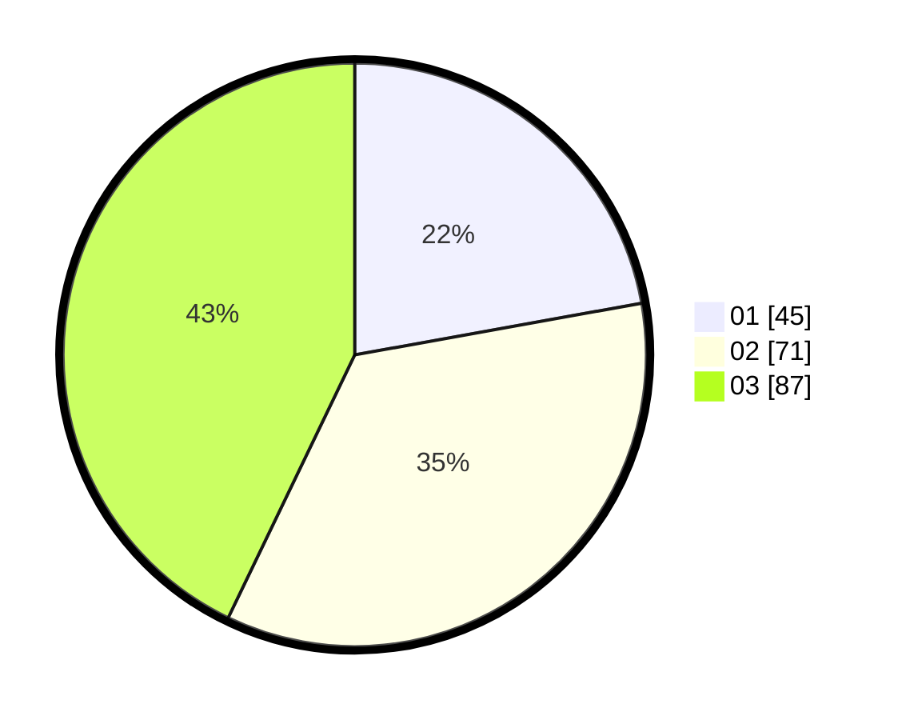

# Hasil

Hasil perolehan suara paslon dapat dilihat pada file paslon-01.txt, paslon-02.txt, dan paslon-03.txt.

Jika tidak ada, artinya data tersebut belum ada pada SIREKAP.

## Perolehan Suara

 * Paslon 01: **45**.
 * Paslon 02: **71**.
 * Paslon 03: **87**.

## Foto C Plano

https://sirekap-obj-formc.kpu.go.id/28e2/pemilu/ppwp/31/73/08/10/02/3173081002072-20240214-210642--a3c1a7a0-392e-441f-a998-3b076d123852.jpg

https://sirekap-obj-formc.kpu.go.id/28e2/pemilu/ppwp/31/73/08/10/02/3173081002072-20240214-210722--0cdfd60a-c5e0-4330-9515-e7c501b46c68.jpg

https://sirekap-obj-formc.kpu.go.id/28e2/pemilu/ppwp/31/73/08/10/02/3173081002072-20240214-210758--b7065254-74dd-4d39-9f47-437cf9da5cbb.jpg
