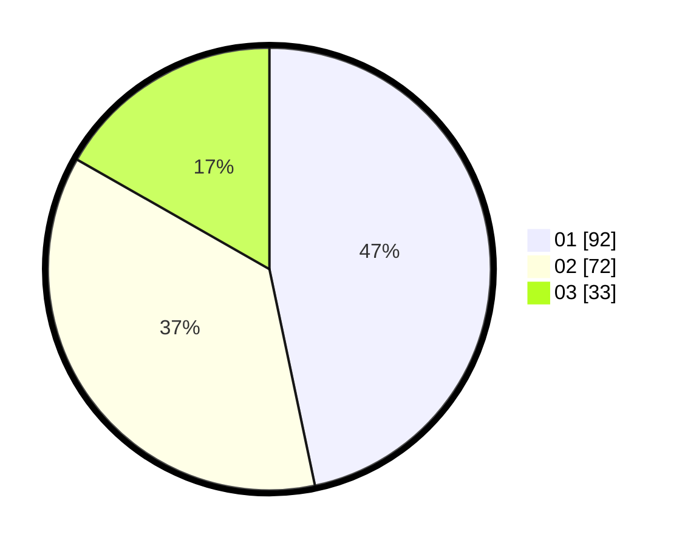

# Hasil

Hasil perolehan suara paslon dapat dilihat pada file paslon-01.txt, paslon-02.txt, dan paslon-03.txt.

Jika tidak ada, artinya data tersebut belum ada pada SIREKAP.

## Perolehan Suara

 * Paslon 01: **92**.
 * Paslon 02: **72**.
 * Paslon 03: **33**.

## Foto C Plano

https://sirekap-obj-formc.kpu.go.id/8324/pemilu/ppwp/31/73/08/10/02/3173081002074-20240214-185015--3d7c4106-698b-4307-b863-507f2a5d08fc.jpg

https://sirekap-obj-formc.kpu.go.id/8324/pemilu/ppwp/31/73/08/10/02/3173081002074-20240214-191418--70c20d5a-a942-4b81-b844-fecc238dc8f7.jpg

https://sirekap-obj-formc.kpu.go.id/8324/pemilu/ppwp/31/73/08/10/02/3173081002074-20240214-185429--19f435a7-dc5c-430b-a9cb-df7f18ceaa60.jpg

## DATA PEMILIH TETAP

Jumlah pemilih dalam DPT: **182**.
 * L: **89**.
 * P: **93**.

## DATA PENGGUNA HAK PILIH

Jumlah pengguna hak pilih dalam DPT: **282**.
 * L: **145**.
 * P: **137**.

Jumlah pengguna hak pilih dalam DPTb: **10**.
 * L: **6**.
 * P: **4**.

Jumlah pengguna hak pilih dalam DPK: **5**.
 * L: **3**.
 * P: **2**.

Jumlah pengguna hak pilih: **297**.
 * L: **154**.
 * P: **143**.

## JUMLAH SUARA SAH DAN TIDAK SAH

JUMLAH SELURUH SUARA SAH: **197**.

JUMLAH SUARA TIDAK SAH: **0**.

JUMLAH SELURUH SUARA SAH DAN SUARA TIDAK SAH: **197**.
