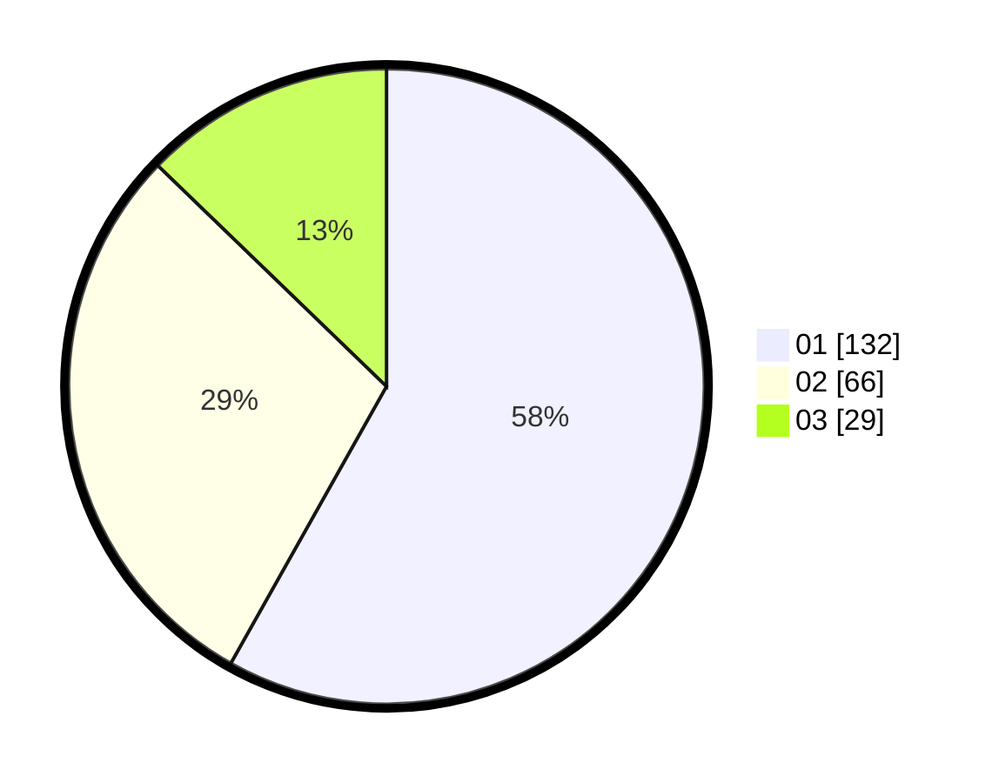

# Hasil

Hasil perolehan suara paslon dapat dilihat pada file paslon-01.txt, paslon-02.txt, dan paslon-03.txt.

Jika tidak ada, artinya data tersebut belum ada pada SIREKAP.

## Perolehan Suara

 * Paslon 01: **132**.
 * Paslon 02: **66**.
 * Paslon 03: **29**.

## Foto C Plano

https://sirekap-obj-formc.kpu.go.id/21b6/pemilu/ppwp/31/73/08/10/02/3173081002080-20240215-171200--fa15d857-d305-4e84-aff0-d38e15e3485a.jpg

https://sirekap-obj-formc.kpu.go.id/21b6/pemilu/ppwp/31/73/08/10/02/3173081002080-20240215-171221--4fe1f312-8647-499c-8fbf-88bc790de3cd.jpg

https://sirekap-obj-formc.kpu.go.id/21b6/pemilu/ppwp/31/73/08/10/02/3173081002080-20240215-171211--9db9cae2-e2fa-4f00-9d18-2aa61d49719d.jpg

## DATA PEMILIH TETAP

Jumlah pemilih dalam DPT: **288**.
 * L: **144**.
 * P: **144**.

## DATA PENGGUNA HAK PILIH

Jumlah pengguna hak pilih dalam DPT: **230**.
 * L: **109**.
 * P: **121**.

Jumlah pengguna hak pilih dalam DPTb: **1**.
 * L: **1**.
 * P: **0**.

Jumlah pengguna hak pilih dalam DPK: **1**.
 * L: **0**.
 * P: **1**.

Jumlah pengguna hak pilih: **232**.
 * L: **110**.
 * P: **122**.

## JUMLAH SUARA SAH DAN TIDAK SAH

JUMLAH SELURUH SUARA SAH: **227**.

JUMLAH SUARA TIDAK SAH: **5**.

JUMLAH SELURUH SUARA SAH DAN SUARA TIDAK SAH: **232**.
