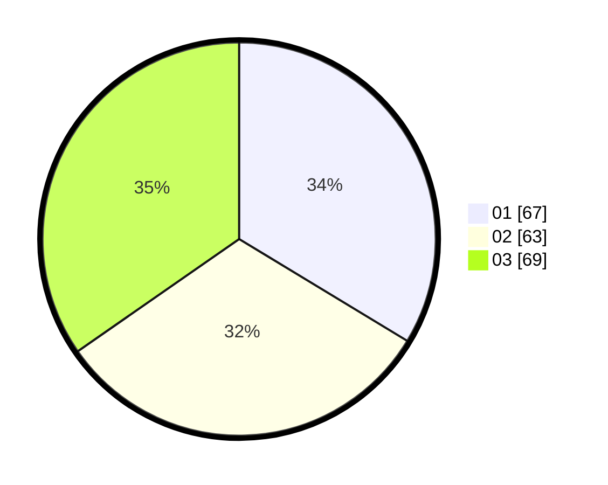

# Hasil

Hasil perolehan suara paslon dapat dilihat pada file paslon-01.txt, paslon-02.txt, dan paslon-03.txt.

Jika tidak ada, artinya data tersebut belum ada pada SIREKAP.

## Perolehan Suara

 * Paslon 01: **67**.
 * Paslon 02: **63**.
 * Paslon 03: **69**.

## Foto C Plano

https://sirekap-obj-formc.kpu.go.id/b327/pemilu/ppwp/31/73/08/10/02/3173081002085-20240216-065656--9df4a784-3d1e-4291-897b-819f9761e3cf.jpg

https://sirekap-obj-formc.kpu.go.id/b327/pemilu/ppwp/31/73/08/10/02/3173081002085-20240216-065657--0428fd72-bc26-485c-9a21-973a460fbb20.jpg

https://sirekap-obj-formc.kpu.go.id/b327/pemilu/ppwp/31/73/08/10/02/3173081002085-20240216-065656--e3c719a4-82e2-46f0-8d3e-7e8ccf2dd4d3.jpg

## DATA PEMILIH TETAP

Jumlah pemilih dalam DPT: **270**.
 * L: **122**.
 * P: **148**.

## DATA PENGGUNA HAK PILIH

Jumlah pengguna hak pilih dalam DPT: **185**.
 * L: **80**.
 * P: **105**.

Jumlah pengguna hak pilih dalam DPTb: **11**.
 * L: **5**.
 * P: **6**.

Jumlah pengguna hak pilih dalam DPK: **3**.
 * L: **2**.
 * P: **1**.

Jumlah pengguna hak pilih: **199**.
 * L: **87**.
 * P: **112**.

## JUMLAH SUARA SAH DAN TIDAK SAH

JUMLAH SELURUH SUARA SAH: **199**.

JUMLAH SUARA TIDAK SAH: **0**.

JUMLAH SELURUH SUARA SAH DAN SUARA TIDAK SAH: **199**.
