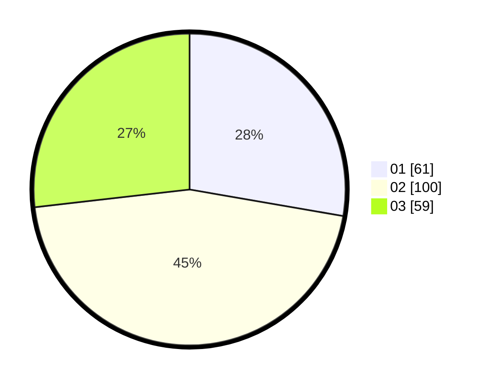

# Hasil

Hasil perolehan suara paslon dapat dilihat pada file paslon-01.txt, paslon-02.txt, dan paslon-03.txt.

Jika tidak ada, artinya data tersebut belum ada pada SIREKAP.

## Perolehan Suara

 * Paslon 01: **61**.
 * Paslon 02: **100**.
 * Paslon 03: **59**.

## Foto C Plano

https://sirekap-obj-formc.kpu.go.id/bbcd/pemilu/ppwp/31/73/08/10/02/3173081002087-20240214-155300--3a063c91-b0b7-400f-9c17-844a080e921e.jpg

https://sirekap-obj-formc.kpu.go.id/bbcd/pemilu/ppwp/31/73/08/10/02/3173081002087-20240214-155449--fd3b488c-3a27-485e-a079-5d21be93d9e2.jpg

https://sirekap-obj-formc.kpu.go.id/bbcd/pemilu/ppwp/31/73/08/10/02/3173081002087-20240215-030402--ec9d1b24-4b06-4825-a043-baa63ce0c5d1.jpg
