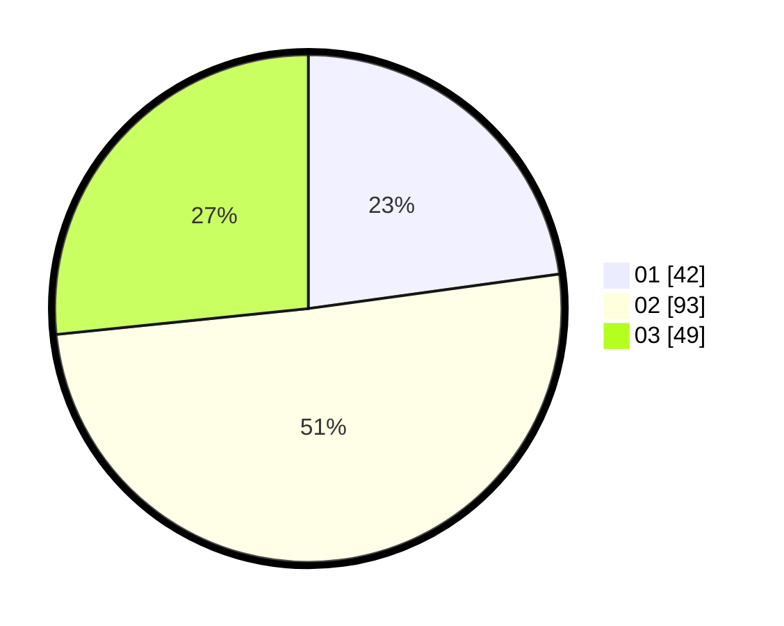

# Hasil

Hasil perolehan suara paslon dapat dilihat pada file paslon-01.txt, paslon-02.txt, dan paslon-03.txt.

Jika tidak ada, artinya data tersebut belum ada pada SIREKAP.

## Perolehan Suara

 * Paslon 01: **42**.
 * Paslon 02: **93**.
 * Paslon 03: **49**.

## Foto C Plano

https://sirekap-obj-formc.kpu.go.id/3afe/pemilu/ppwp/31/73/08/10/02/3173081002089-20240215-001446--fde0fd2c-b72f-41b4-812f-f6eb9d2ac147.jpg

https://sirekap-obj-formc.kpu.go.id/3afe/pemilu/ppwp/31/73/08/10/02/3173081002089-20240215-001627--dfb6b7f3-45bd-47a2-9ef2-bd5b9ec02c43.jpg

https://sirekap-obj-formc.kpu.go.id/3afe/pemilu/ppwp/31/73/08/10/02/3173081002089-20240215-001730--58e0329d-5b6d-4320-a7e3-240963ffc496.jpg
