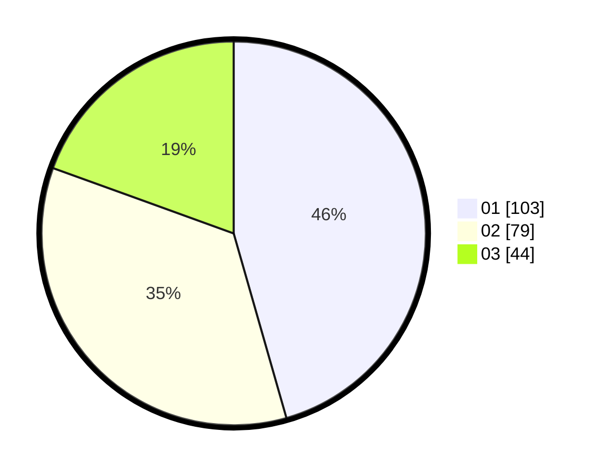

# Hasil

Hasil perolehan suara paslon dapat dilihat pada file paslon-01.txt, paslon-02.txt, dan paslon-03.txt.

Jika tidak ada, artinya data tersebut belum ada pada SIREKAP.

## Perolehan Suara

 * Paslon 01: **103**.
 * Paslon 02: **79**.
 * Paslon 03: **44**.

## Foto C Plano

https://sirekap-obj-formc.kpu.go.id/1ac8/pemilu/ppwp/31/73/08/10/02/3173081002090-20240215-000147--42ff437d-fb87-44b8-9e7d-fe0428837f03.jpg

https://sirekap-obj-formc.kpu.go.id/1ac8/pemilu/ppwp/31/73/08/10/02/3173081002090-20240215-001227--d9efb13b-c2a8-42c7-a8bc-ac7ffe6fb3a4.jpg

https://sirekap-obj-formc.kpu.go.id/1ac8/pemilu/ppwp/31/73/08/10/02/3173081002090-20240215-001246--97b3550d-c2b0-4b03-a77e-60025cb7ea23.jpg
