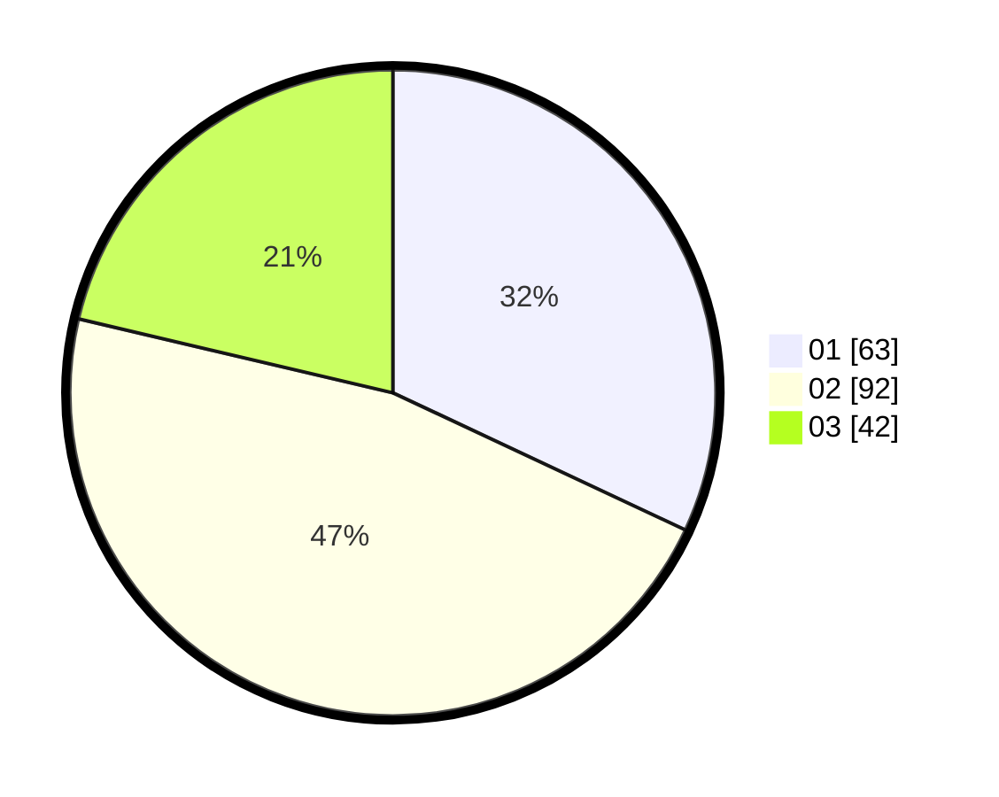

# Hasil

Hasil perolehan suara paslon dapat dilihat pada file paslon-01.txt, paslon-02.txt, dan paslon-03.txt.

Jika tidak ada, artinya data tersebut belum ada pada SIREKAP.

## Perolehan Suara

 * Paslon 01: **63**.
 * Paslon 02: **92**.
 * Paslon 03: **42**.

## Foto C Plano

https://sirekap-obj-formc.kpu.go.id/a39a/pemilu/ppwp/31/73/08/10/02/3173081002092-20240214-204310--d9a17b24-3e2c-41ff-9b5b-99cf4b1de58a.jpg

https://sirekap-obj-formc.kpu.go.id/a39a/pemilu/ppwp/31/73/08/10/02/3173081002092-20240214-204728--7ab7080a-842b-49fb-b9e3-f3f69bde98b9.jpg

https://sirekap-obj-formc.kpu.go.id/a39a/pemilu/ppwp/31/73/08/10/02/3173081002092-20240214-204517--8de0acb1-faab-45e4-8142-b28ed86f4054.jpg

## DATA PEMILIH TETAP

Jumlah pemilih dalam DPT: **275**.
 * L: **134**.
 * P: **141**.

## DATA PENGGUNA HAK PILIH

Jumlah pengguna hak pilih dalam DPT: **195**.
 * L: **95**.
 * P: **100**.

Jumlah pengguna hak pilih dalam DPTb: **3**.
 * L: **1**.
 * P: **2**.

Jumlah pengguna hak pilih dalam DPK: **0**.
 * L: **0**.
 * P: **0**.

Jumlah pengguna hak pilih: **198**.
 * L: **96**.
 * P: **102**.

## JUMLAH SUARA SAH DAN TIDAK SAH

JUMLAH SELURUH SUARA SAH: **197**.

JUMLAH SUARA TIDAK SAH: **1**.

JUMLAH SELURUH SUARA SAH DAN SUARA TIDAK SAH: **198**.
