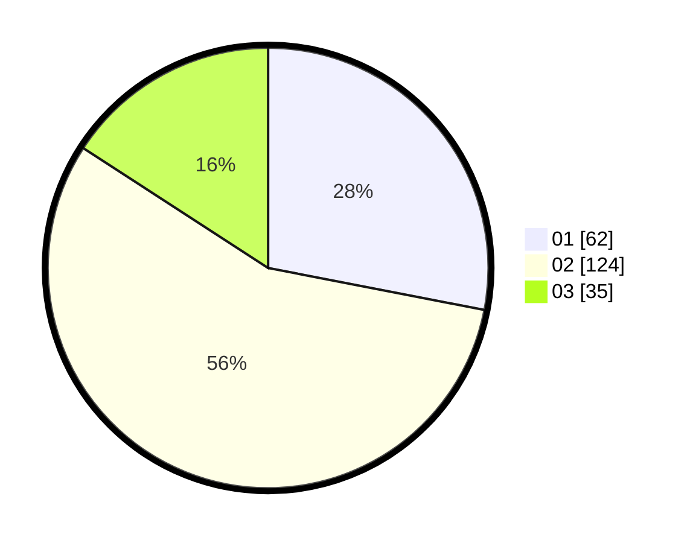

# Hasil

Hasil perolehan suara paslon dapat dilihat pada file paslon-01.txt, paslon-02.txt, dan paslon-03.txt.

Jika tidak ada, artinya data tersebut belum ada pada SIREKAP.

## Perolehan Suara

 * Paslon 01: **62**.
 * Paslon 02: **124**.
 * Paslon 03: **35**.

## Foto C Plano

https://sirekap-obj-formc.kpu.go.id/2e25/pemilu/ppwp/31/73/08/10/02/3173081002093-20240215-011253--9d90fb83-f841-4609-a356-0349ab612277.jpg

https://sirekap-obj-formc.kpu.go.id/2e25/pemilu/ppwp/31/73/08/10/02/3173081002093-20240215-114355--e0d5bbce-1308-4ac2-9d0b-f176f8a83198.jpg

https://sirekap-obj-formc.kpu.go.id/2e25/pemilu/ppwp/31/73/08/10/02/3173081002093-20240215-011548--2b1c9c71-e80d-436c-b8dd-1737e7cc7be3.jpg
