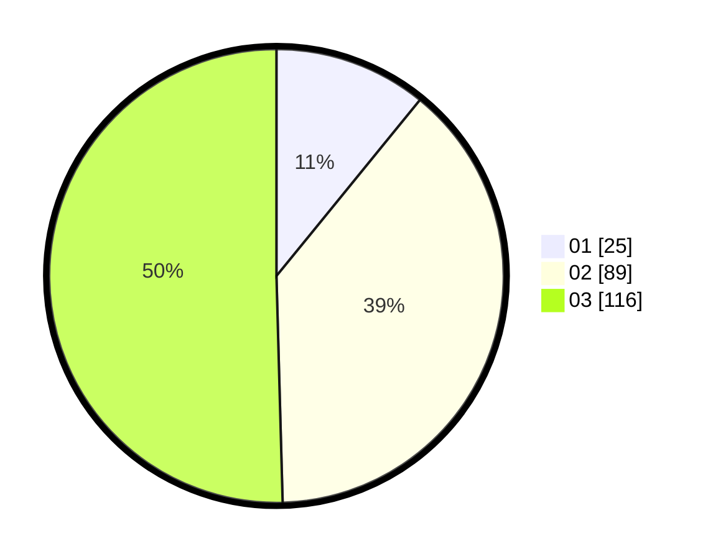

# Hasil

Hasil perolehan suara paslon dapat dilihat pada file paslon-01.txt, paslon-02.txt, dan paslon-03.txt.

Jika tidak ada, artinya data tersebut belum ada pada SIREKAP.

## Perolehan Suara

 * Paslon 01: **25**.
 * Paslon 02: **89**.
 * Paslon 03: **116**.

## Foto C Plano

https://sirekap-obj-formc.kpu.go.id/8f04/pemilu/ppwp/31/73/08/10/02/3173081002094-20240214-213320--84942263-7c23-4dee-81ff-7160474a90c1.jpg

https://sirekap-obj-formc.kpu.go.id/8f04/pemilu/ppwp/31/73/08/10/02/3173081002094-20240214-213404--839ae8af-7333-44f5-a55b-ea3840415e23.jpg

https://sirekap-obj-formc.kpu.go.id/8f04/pemilu/ppwp/31/73/08/10/02/3173081002094-20240214-213506--0ed9636c-f1d8-48d1-9b9d-8601ac55f255.jpg

## DATA PEMILIH TETAP

Jumlah pemilih dalam DPT: **267**.
 * L: **126**.
 * P: **141**.

## DATA PENGGUNA HAK PILIH

Jumlah pengguna hak pilih dalam DPT: **223**.
 * L: **103**.
 * P: **120**.

Jumlah pengguna hak pilih dalam DPTb: **1**.
 * L: **1**.
 * P: **0**.

Jumlah pengguna hak pilih dalam DPK: **7**.
 * L: **3**.
 * P: **4**.

Jumlah pengguna hak pilih: **231**.
 * L: **107**.
 * P: **124**.

## JUMLAH SUARA SAH DAN TIDAK SAH

JUMLAH SELURUH SUARA SAH: **230**.

JUMLAH SUARA TIDAK SAH: **1**.

JUMLAH SELURUH SUARA SAH DAN SUARA TIDAK SAH: **231**.
