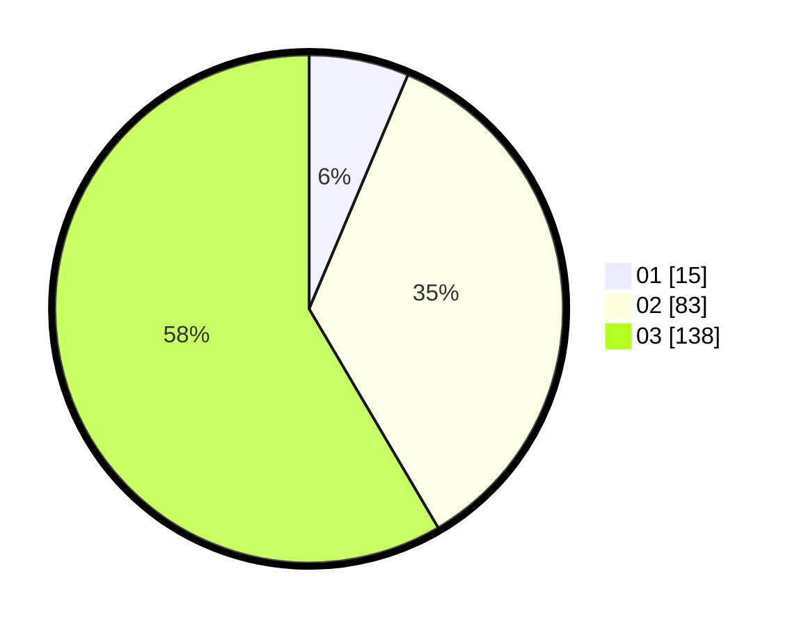

# Hasil

Hasil perolehan suara paslon dapat dilihat pada file paslon-01.txt, paslon-02.txt, dan paslon-03.txt.

Jika tidak ada, artinya data tersebut belum ada pada SIREKAP.

## Perolehan Suara

 * Paslon 01: **15**.
 * Paslon 02: **83**.
 * Paslon 03: **138**.

## Foto C Plano

https://sirekap-obj-formc.kpu.go.id/263a/pemilu/ppwp/31/73/08/10/02/3173081002095-20240214-200438--83c82ff9-20f9-46ae-beeb-2543ccd705db.jpg

https://sirekap-obj-formc.kpu.go.id/263a/pemilu/ppwp/31/73/08/10/02/3173081002095-20240214-193306--7025a3a0-317f-4626-9da6-36679e42e67c.jpg

https://sirekap-obj-formc.kpu.go.id/263a/pemilu/ppwp/31/73/08/10/02/3173081002095-20240214-212434--9d8dad92-3cf1-4e42-b7f9-91a3b3c39b5b.jpg

## DATA PEMILIH TETAP

Jumlah pemilih dalam DPT: **233**.
 * L: **128**.
 * P: **645**.

## DATA PENGGUNA HAK PILIH

Jumlah pengguna hak pilih dalam DPT: **335**.
 * L: **305**.
 * P: **132**.

Jumlah pengguna hak pilih dalam DPTb: **883**.
 * L: **808**.
 * P: **881**.

Jumlah pengguna hak pilih dalam DPK: **802**.
 * L: **488**.
 * P: **886**.

Jumlah pengguna hak pilih: **238**.
 * L: **725**.
 * P: **133**.

## JUMLAH SUARA SAH DAN TIDAK SAH

JUMLAH SELURUH SUARA SAH: **236**.

JUMLAH SUARA TIDAK SAH: **2**.

JUMLAH SELURUH SUARA SAH DAN SUARA TIDAK SAH: **238**.
